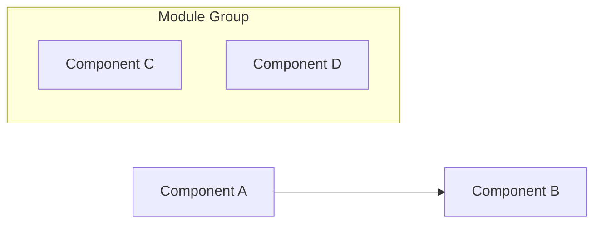

# Project Documentation Generator

**Note**: Ensure that there is exactly one blank line after each section title before the content (e.g., **Processo de Inscrição da Estácio**\n\nYour text...).

**Context**: This prompt generates comprehensive project documentation for any external project specified by the user. This is a template within for analyzing and documenting third-party projects, tools, frameworks, or libraries.

**Instructions**: 
1. Identify the project's official repository (cloned in #folder:src/estacio-lead-integration) and the corresponding repository with an URL stated in the webloc file in #file:resources/quero-edu:estacio-lead-integration.webloc
2. Fetch and analyze the project's official documentation e.g. #file:src/estacio-lead-integration/README.md and many other references appointed by this file and files under #folder:src/estacio-lead-integration/__docs__
3. Generate comprehensive documentation following the structure and formatting rules below
4. Focus on the project being analyzed identified by its official repository mentioned above
5. Use Portuguese (Brazil) language for all sections

# Documentation for Estácio Lead Integration


## Contents

Do: Generate a comprehensive table of contents for the project documentation, including anchor links to each major section. 

**Format**: Use `- [Section Title](#section-title)` for each section, where section titles are converted to lowercase with spaces replaced by hyphens.

**Required sections**:
- Processo de Inscrição da Estácio 
- Arquitetura
- Perspectivas Alternativas
- Lista de IES/integradores com integração ativa (catálogo)
- Esquema de payloads esperados por tipo de evento (ex: inscrição, interesse)
- Padrão de autenticação por tipo de integração (API Key, Crawler);
- Endpoints de envio
- Regras de negócio por integração ativa
- Definição de eventos mínimos por tipo de ação (ex: lead_enviado, inscricao_realizada)
- Formato de resposta esperado das APIs externas
- Mapear os status de processamento que temos na kroton_lead_integration_silver.follow_ups
  ERROR
  SUCCESS
  NEW
  PROCESSING
- References


### Processo de Inscrição da Estácio

Do: Summarize the external project comprehensively:

**Requirements**: 
- Write 2-3 paragraphs explaining the project's purpose, goals, and main functionality
- Include key features and benefits of the external project
- Mention target audience or use cases for the project
- Explain why this project is relevant or interesting to analyze
- Keep language clear and accessible

### Arquitetura

Do: Create a comprehensive Mermaid diagram showing the external project's architecture and data flow.

**Requirements**:
- Analyze the project's documentation, source code (if available), or architectural descriptions
- Use appropriate Mermaid diagram types (flowchart, sequence, class, etc.)
- Identify and map key components, modules, or services of the external project
- Show relationships and data flow between components
- Use subgraphs to group related functionality within the project
- Keep component names concise but descriptive
- Include external dependencies or integrations the project uses
- Base the diagram on publicly available information about the project's architecture

**Format**: Wrap the Mermaid code in ```mermaid code blocks

**Example structure**:


**Mermaid Diagram Requirements**:
- Before creating any diagram, use the get-syntax-docs-mermaid tool to understand proper syntax
- After creating diagrams, use mermaid-diagram-validator to ensure correctness
- Use mermaid-diagram-preview to visualize the final result
- Focus on these specific diagram types:
  - Main architecture: Use flowchart for system overview
  - Data flow: Use sequence diagrams for API interactions
  - Database relationships: Use ER diagrams if applicable
  - State management: Use state diagrams for processing flows

#### Alternative Perspectives

Do: Create additional Mermaid diagrams to provide different visual perspectives on the external project's content and architecture. Include the ones that would enhance the understanding e.g. sequence.

**Requirements for Alternative Perspectives**:
- Each diagram should provide a unique viewpoint of the project's architecture or workflow
- Use appropriate Mermaid syntax for each diagram type (classDiagram, stateDiagram, mindmap)
- Focus on different aspects: dependencies/models, structural, behavioral (state), and conceptual (mind map)
- Ensure diagrams complement rather than duplicate the main architecture diagram
- Base all diagrams on the external project's documented features and architecture
- **Use collapsible sections** to keep the main documentation clean and readable while providing detailed technical diagrams on-demand

**Benefits of Collapsible Sections**:
- Improves document readability by reducing visual clutter
- Allows users to access detailed diagrams only when needed
- Maintains comprehensive technical coverage without overwhelming casual readers
- Follows modern documentation best practices for progressive disclosure

**Format**: 
- Wrap each diagram in HTML `<details>` and `<summary>` tags for collapsible sections
- Use descriptive summary text with "(Click to expand)" instruction
- Include Mermaid code blocks within the collapsible sections

**Example format for an Alternative Perspective**:
```html
<details>
<summary><strong>1. Sequence Diagram</strong> (Click to expand)</summary>

```mermaid
```

</details>
```

#### Key Concepts

Do: Generate a comprehensive list of key concepts, terms, and architectural patterns used in the external project.

**Requirements**:
- Extract concepts from the project's documentation, source code, and community resources
- Provide clear, concise definitions (1-2 sentences each) based on the project's own terminology
- Include both technical and domain-specific terms relevant to the project
- Order by importance or logical grouping within the project's context
- Focus on concepts that are central to understanding how the project works

**Format**: Use bullets with * and bold concept names:
* **Concept Name**: Clear definition explaining what it is and its role in the external project
* **Another Concept**: Definition with context about how it relates to the project's overall system

**Example** (for a hypothetical project):
* **Event-Driven Architecture**: The project uses asynchronous event processing for handling user interactions
* **Plugin System**: Extensible architecture allowing third-party developers to add functionality


### Lista de IES/integradores com integração ativa (catálogo)

Do: Create a detailed catalog of all known institutions (IES) or integrators that have active integrations with the external project.


### Esquema de payloads esperados por tipo de evento

**Specific Requirements**:
- Extract actual payload schemas from source code
- Use JSON schema format or TypeScript interfaces
- Include examples for each event type: inscrição, interesse, LGPD sync
- Document required vs optional fields
- Show validation rules if available

Do: Define the expected payload schemas for different event types handled by the external project.


### Padrão de autenticação por tipo de integração (API Key, Crawler)

Do: Document the authentication patterns used by the external project for different types of integrations (e.g., API Key, OAuth, Crawler).


### Endpoints de envio

Do: List and describe all known endpoints used by the external project for sending data or receiving requests.

### Regras de negócio por integração ativa

Do: Outline the business rules and logic applied by the external project for each active integration.

### Definição de eventos mínimos por tipo de ação (ex: lead_enviado, inscricao_realizada)

Do: Define the minimum required events for each type of action supported by the external project.

### Formato de resposta esperado das APIs externas

Do: Specify the expected response formats from external APIs that the project interacts with.

### Status de processamento que temos na tabela follow_ups

  Do: Map and explain the processing statuses used in the `kroton_lead_integration_silver.follow_ups` table.
  ERROR
  SUCCESS
  NEW
  PROCESSING


### References

Do: Compile all references and resources used to create the documentation about the external project.

**Sources to include**:
- Project's official documentation, GitHub repository, and wiki pages
- All files and links in #folder:resources related to this external project
- Official API documentation or technical specifications
- Community tutorials, blog posts, and learning resources about the project
- Related tools, libraries, or competing projects for context
- Academic papers or technical articles that reference the project

**Requirements**:
- Verify all URLs are accessible and current
- Group related references together (official docs, community resources, etc.)
- Provide brief descriptions for each reference explaining its relevance to understanding the project
- Include access dates for web resources
- Prioritize official sources from the project maintainers

**Format**: Use bullets with * for each reference:
* [Reference Title](URL) - Brief description of what this resource contains and why it's relevant to understanding the external project
* [Another Reference](URL) - Description of its contribution to understanding the project's functionality, architecture, or ecosystem

**Quality Guidelines**:
- Prioritize official and authoritative sources from the project itself
- Include primary sources over secondary when possible
- Ensure references add value and aren't redundant
- Focus on resources that help understand the external project, not the zsh-today-manager system

---

## Quality Assurance Guidelines

**Documentation Quality**:
- Ensure all sections are relevant to the specific external project being analyzed
- Use consistent formatting and markdown syntax
- Verify all code examples are syntactically correct according to the external project's standards
- Test all URLs and links for accessibility, especially official project resources
- Check grammar and spelling throughout
- Maintain objectivity when describing the external project

**Content Completeness**:
- Include only sections that apply to the external project
- Skip sections with "if applicable" when not relevant to the specific project
- Ensure architecture diagrams accurately reflect the external project's documented architecture
- Validate technical stack information against the external project's actual dependencies and documentation
- Base all information on publicly available, credible sources

**Consistency Guidelines**:
- Use the same terminology throughout the document, preferring the external project's own terminology
- Maintain consistent code formatting and style as used by the external project
- Follow the external project's existing documentation patterns when possible
- Ensure examples align with the external project's actual API or interface
- Distinguish clearly between official information and community-generated content

**Update Instructions**:
- Review and update documentation when the external project releases new versions
- Verify references and links remain current, especially for rapidly evolving projects
- Update version numbers and dependency information based on the latest project releases
- Refresh examples to reflect the external project's current best practices and API changes
- Note the date of analysis since external projects evolve independently

**Output Requirements**:
- Generate the documentation as a new file: `/home/roberto/Projects/project-qeevo-api-integrations-docs/contents/estacio-lead-integration.md`
- Follow the exact structure and formatting specified below
- Ensure proper markdown syntax throughout

**Initial Analysis Steps**:
1. First, read and analyze the complete README.md from the estacio-lead-integration folder
2. Examine all files in the #folder:src/estacio-lead-integration/__docs__ folder for additional technical specifications
3. Review the source code structure in the #folder:src/estacio-lead-integration directory to understand the architecture
4. Check the package.json for dependencies and available scripts
5. Look for any API documentation or configuration files

**Research Instructions**:
- Use fetch_webpage tool to gather information from the official Estácio integration documentation
- Check the GitHub repository URL from the #file:resources/quero-edu:estacio-lead-integration.webloc file for additional context
- Look for public API documentation related to Estácio integrations

**Technical Analysis Requirements**:
- Analyze TypeScript/Node.js codebase architecture
- Identify database schemas and migrations
- Document API endpoints and their purposes
- Map authentication mechanisms used
- Identify error handling patterns and status codes
- Document environment variables and configuration options

**Handling Missing Information**:
- If specific information is not available in the codebase, clearly state "Information not available in current codebase"
- Suggest where additional information might be found
- Do not fabricate or assume technical details


