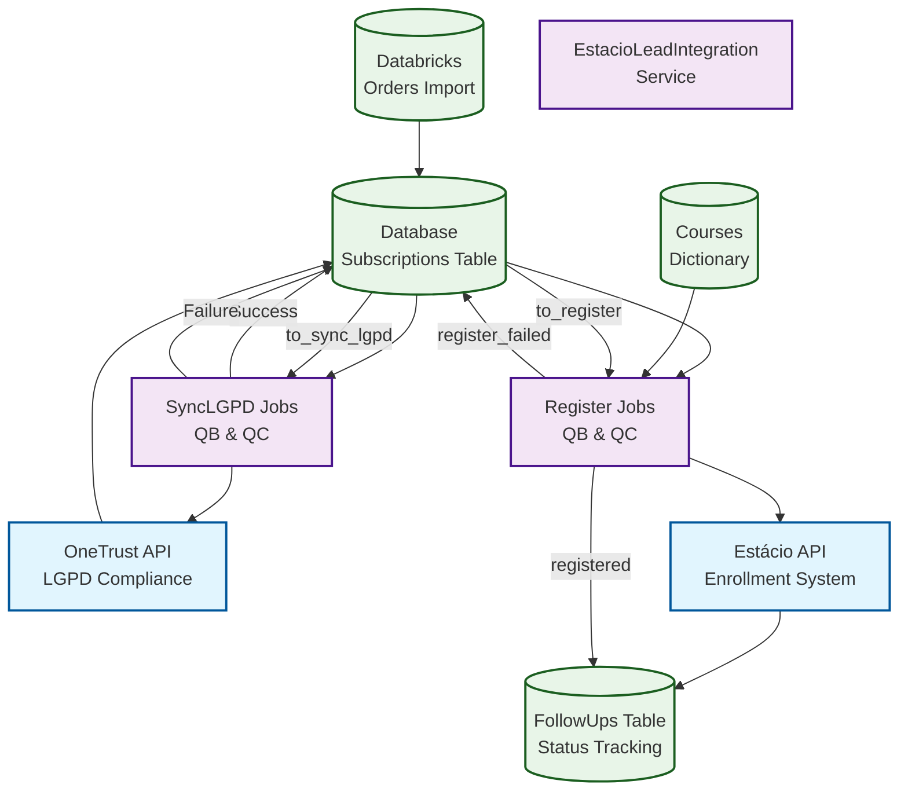
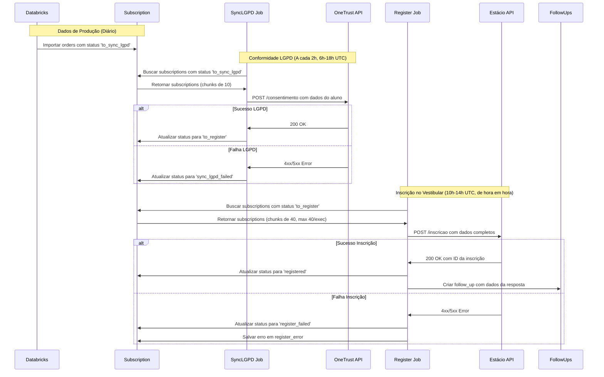
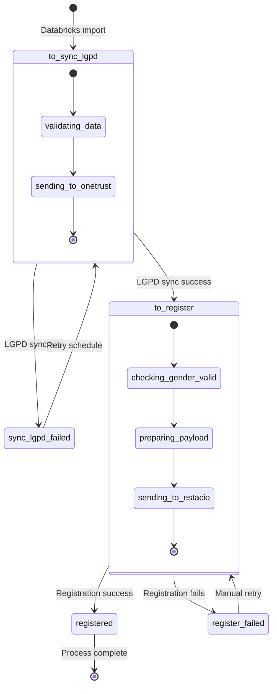

# Integração de Leads da Estácio

## Contents

- [Processo de Inscrição da Estácio](#processo-de-inscrição-da-estácio)
- [Arquitetura](#arquitetura)
- [Perspectivas Alternativas](#perspectivas-alternativas)
- [Lista de IES/integradores com integração ativa](#lista-de-iesintegradores-com-integração-ativa)
- [Esquema de payloads esperados por tipo de evento](#esquema-de-payloads-esperados-por-tipo-de-evento)
- [Padrão de autenticação por tipo de integração](#padrão-de-autenticação-por-tipo-de-integração)
- [Endpoints de envio](#endpoints-de-envio)
- [Regras de negócio por integração ativa](#regras-de-negócio-por-integração-ativa)
- [Definição de eventos mínimos por tipo de ação](#definição-de-eventos-mínimos-por-tipo-de-ação)
- [Formato de resposta esperado das APIs externas](#formato-de-resposta-esperado-das-apis-externas)
- [Status de processamento - follow_ups table](#status-de-processamento---follow_ups-table)
- [References](#references)

## Processo de Inscrição da Estácio

O sistema de integração de leads da Estácio é um serviço Node.js/TypeScript que automatiza o processo de inscrição de estudantes no vestibular da Estácio através de suas APIs oficiais. Este sistema funciona como ponte entre o ecossistema Quero Educação (Quero Bolsa e Quero Curso) e os sistemas internos da Estácio, garantindo conformidade com a LGPD e processamento eficiente de inscrições.

O processo é dividido em duas etapas principais: primeiro a sincronização LGPD obrigatória através da API OneTrust da Estácio, onde são registrados os consentimentos e dados pessoais dos alunos; em seguida, a inscrição propriamente dita no sistema de vestibular da Estácio. O sistema processa automaticamente milhares de inscrições diariamente, com controle de rate limiting, retry automático em caso de falhas, e notificações via Slack para monitoramento.

Características principais incluem suporte para diferentes modalidades de curso (presencial/EAD), níveis educacionais (graduação, segunda graduação, técnico, pós-técnico), turnos variados, e integração com múltiplos campus. O sistema mantém rastreabilidade completa através da tabela `follow_ups`, permitindo acompanhamento do status de cada inscrição desde o registro inicial até a confirmação final.

## Arquitetura



A arquitetura segue um padrão baseado em jobs com processamento em chunks para respeitar rate limits das APIs externas. O serviço principal (`EstacioLeadIntegration`) coordena múltiplos jobs que processam diferentes tipos de subscriptions (QB - Quero Bolsa, QC - Quero Curso). Cada job herda da classe base `Base` que implementa o padrão de chunking, interval processing e logging centralizado.

O sistema utiliza TypeORM para gerenciamento de entidades e migrations, com PostgreSQL como banco de dados principal. A camada de serviços (`services/`) abstrai integrações com APIs externas, enquanto factories (`factories/`) padronizam a criação de objetos Student a partir de Subscriptions. O processamento é scheduled via cron jobs com horários específicos para otimizar performance e evitar conflitos.

## Perspectivas Alternativas

<details>
<summary><strong>Sequence Diagram - Processo de Inscrição</strong> (Clique para expandir)</summary>



</details>

<details>
<summary><strong>State Diagram - Estados da Subscription</strong> (Clique para expandir)</summary>



</details>

## Lista de IES/integradores com integração ativa

| Instituição | Tipo de Integração | Status | Notas |
|-------------|-------------------|--------|-------|
| **Estácio** | API Direta | ✅ Ativo | Integração principal via API oficial |
| **Wyden** | API Compartilhada | ✅ Ativo | Utiliza mesma base da Estácio (university_ids: 83, 511, 517, 638, 835, 944, 951, 1106, 1228, 1309, 3569) |
| **OneTrust** | LGPD Compliance | ✅ Ativo | Pré-requisito obrigatório para todas as inscrições |
| **Quero Bolsa** | Origem de Dados | ✅ Ativo | Processado via jobs syncLGPDQB e registerQB |
| **Quero Curso** | Origem de Dados | ✅ Ativo | Processado via jobs syncLGPDQC e registerQC |

## Esquema de payloads esperados por tipo de evento

### registerQB / registerQC (Inscrição no Vestibular)

**Input (Subscription data):**
```typescript
interface SubscriptionPayload {
  id: number;
  type: 'quero_bolsa' | 'captacao';
  university_id: number;
  university_name: string;
  user_name: string;
  cpf: string;
  gender?: string;
  birthday: string; // formato: YYYY-MM-DD
  email: string;
  area_code: string;
  phone_number: string;
  address: string;
  address_number: string;
  postal_code: string;
  neighborhood: string;
  student_city: string;
  student_state: string;
  qb_course_name: string;
  university_course_name: string;
  modalidade: string; // 'Presencial' | 'EaD'
  nivel: string; // 'Graduação' | 'Segunda Graduação' | 'Técnico' | 'Pós-técnico'
  turno: string;
  campi: string;
  mensalidade_qb: number;
  mensalidade_cheia: number;
  metadata: string; // JSON string
  order_id?: number;
  order_checkout_step?: string; // 'paid' | outros
}
```

**Output (Estácio API payload):**
```typescript
interface EstacioRegistrationPayload {
  codFormaIngresso: string; // '24' padrão, '2' segunda graduação, '15' técnico
  codCampus: number;
  numHabilitacao: number;
  codTurno: string;
  indModalidade: string; // 'P' presencial, 'E' EaD
  nomeCandidato: string;
  enderecoEmail: string;
  numTelefoneCelular: string;
  cpfCandidato: string; // apenas números
  dataNascimento: string; // formato: DD/MM/YYYY
  cepCandidato: string;
  siglaUF: string;
  endCandidato: string;
  numEndCandidato: string;
  codMunicipio: number;
  codBairro: number;
  codAgentePdv: number; // 11379 se 'paid', 14412833 caso contrário
  codCurso: number;
  // Campos ENEM (sempre null para esta integração)
  numInscEnem: null;
  anoEnem: null;
  numNotaCienciasHumanas: null;
  numNotaCienciasNatureza: null;
  numNotaLinguagens: null;
  numNotaMatematica: null;
  numNotaRedacao: null;
}
```

### syncLGPDQB / syncLGPDQC (Conformidade LGPD)

**OneTrust API payload:**
```typescript
interface OneTrustPayload {
  documento: string; // CPF apenas números
  pontoColetaToken: string;
  finalidades: Array<{
    id: string;
    preferencias: Array<{
      idTopico: string;
    }>;
  }>;
  atributos: Array<{
    atributo: string;
    valor: string;
  }>;
  // Atributos padrão: Nome, Data de Nascimento, CEP, Endereço, etc.
}
```

## Padrão de autenticação por tipo de integração

### Estácio API
```typescript
// Headers de autenticação
{
  'x-canal': process.env.API_ESTACIO_CLIENT_ID,
  'x-api-key': process.env.API_ESTACIO_NEW_TOKEN
}
```

### OneTrust API  
```typescript
// Headers de autenticação
{
  'client_id': process.env.API_ONETRUST_CLIENT_ID,
  'client_secret': process.env.API_ONETRUST_CLIENT_SECRET
}
```

### Variáveis de Ambiente Necessárias
```bash
# Estácio API Configuration
API_ESTACIO_BASE_URL=https://api.estacio.br
API_ESTACIO_NEW_BASE_URL=https://newapi.estacio.br
API_ESTACIO_CLIENT_ID=partner_client_id
API_ESTACIO_TOKEN=legacy_token
API_ESTACIO_NEW_TOKEN=new_api_key

# OneTrust API Configuration  
API_ONETRUST_BASE_URL=https://api.onetrust.estacio.br
API_ONETRUST_CLIENT_ID=onetrust_client_id
API_ONETRUST_CLIENT_SECRET=onetrust_client_secret
API_ONETRUST_FINALIDADE_ID=finalidade_uuid
API_ONETRUST_TOPICO_ID=topico_uuid
API_ONETRUST_TOKEN=collection_point_token
```

## Endpoints de envio

### Estácio API Endpoints
- **Base URL:** `API_ESTACIO_NEW_BASE_URL`
- **Inscrição:** `POST /inscricao`
- **Headers:** x-canal, x-api-key
- **Rate Limit:** 40 requests por execução, chunks de 40, intervalo entre chunks

### OneTrust API Endpoints  
- **Base URL:** `API_ONETRUST_BASE_URL`
- **Consentimento:** `POST /consentimento` (endpoint inferido do código)
- **Headers:** client_id, client_secret  
- **Rate Limit:** 10 requests por chunk, intervalo de 150s entre chunks

### Endpoints de Apoio
- **Location Service:** Para resolução de códigos de município e bairro
- **Catalog Service:** Para consulta de cursos e campus

## Regras de negócio por integração ativa

### Regras de Status
1. **to_sync_lgpd → to_register:** Apenas após sucesso na sincronização LGPD
2. **to_register:** Requer gender válido (se não preenchido, é ignorado mas não bloqueia)
3. **registered:** Status final de sucesso, gera follow_up automaticamente

### Regras de Retry
```typescript
// Baseado no método isRetry() da classe base
isRetry(registerError: string): boolean {
  // Verifica se existe erro anterior e implementa lógica de retry
  // Altera campus entre codCampus e codCampusPai em caso de retry
}
```

### Regras de Campus
- **Primeira tentativa:** Usa `codCampusPai` ou `codCampus` do metadata
- **Retry:** Alterna entre `codCampus` e `codCampusPai`
- **Wyden:** Tratamento especial para university_ids específicos

### Regras de Forma de Ingresso
```typescript
const codFormaIngresso = {
  'default': '24',
  'Segunda Graduação': '2', 
  'Técnico': '15',
  'Pós-técnico': '15'
}
```

### Regras de Agente PDV
- **order_checkout_step === 'paid':** codAgentePdv = 11379
- **Outros casos:** codAgentePdv = 14412833

## Definição de eventos mínimos por tipo de ação

### SyncLGPD Actions
**Eventos obrigatórios:**
1. `subscription.status = 'to_sync_lgpd'` → Trigger do job
2. `onetrust.create(subscription)` → Chamada LGPD
3. `subscription.status = 'to_register'` → Sucesso
4. `subscription.status = 'sync_lgpd_failed'` → Falha

**Scheduling:**
- **Horário:** A cada 2 horas, das 6h às 18h UTC (3h às 15h BRT)
- **Chunk size:** 10 subscriptions
- **Intervalo:** 150 segundos entre chunks

### Register Actions
**Eventos obrigatórios:**
1. `subscription.status = 'to_register'` → Trigger do job
2. `estacio.registerSubscription(subscription)` → Chamada inscrição
3. `followUp.create()` → Registro de rastreamento
4. `subscription.status = 'registered'` → Sucesso
5. `subscription.status = 'register_failed'` → Falha

**Scheduling:**
- **Horário:** Das 10h às 14h UTC (7h às 11h BRT), de hora em hora
- **Chunk size:** 40 subscriptions  
- **Máximo por execução:** 40 subscriptions

## Formato de resposta esperado das APIs externas

### Estácio API Response
```typescript
interface EstacioSuccessResponse {
  data: {
    id: string; // ID da inscrição na Estácio
    status: string;
    // outros campos específicos da API
  };
}

interface EstacioErrorResponse {
  status: number; // 4xx ou 5xx
  message: string;
  details?: any;
}
```

### OneTrust API Response  
```typescript
interface OneTrustSuccessResponse {
  // Estrutura específica da API OneTrust
  success: boolean;
  consentId?: string;
}

interface OneTrustErrorResponse {
  status: number;
  error: string;
  details?: any;
}
```

## Status de processamento - follow_ups table

**Estrutura da tabela:**
```typescript
interface FollowUp {
  id: number;
  estacio_subscription_id: string; // ID retornado pela Estácio
  source: any; // JSON com resposta completa da API
  subscription: Subscription; // Relação com subscription
  created_at: Date;
  updated_at: Date;
}
```

**Status de processamento inferidos do código:**

### SUCCESS
- **Definição:** Inscrição processada com sucesso pela API da Estácio
- **Trigger:** Response 2xx da API Estácio + criação de follow_up
- **Resultado:** `subscription.status = 'registered'`

### ERROR  
- **Definição:** Falha na comunicação ou processamento da API Estácio
- **Trigger:** Response 4xx/5xx da API Estácio
- **Resultado:** `subscription.status = 'register_failed'` + `register_error` preenchido

### NEW
- **Definição:** Subscription criada mas ainda não processada
- **Trigger:** Importação inicial do Databricks
- **Estado inicial:** `subscription.status = 'to_sync_lgpd'`

### PROCESSING
- **Definição:** Status implícito durante execução dos jobs
- **Contexto:** Entre início do job e conclusão (sucesso/erro)
- **Duração:** Temporário durante processamento do chunk

## References

- **Repositório GitHub:** https://github.com/quero-edu/estacio-lead-integration
- **Databricks Notebook:** [Importação de Dados de Produção](https://dbc-62e10648-e631.cloud.databricks.com/?o=4536875224054584#notebook/4213855866222532/command/4213855866222534)
- **Documentação Oficial Estácio:** 
  - [Guia para Parceiros](/__docs__/guia-de-parceiros.pdf)
  - [Glossário de Termos](/__docs__/lista-glossario.xlsx)
- **Arquitetura de Segurança:** [Formulário de Arquitetura](https://forms.office.com/r/Y5P0mf4nM5)
- **Compliance LGPD:** [Formulário de Segurança](https://forms.office.com/r/pt61sjAi1p)
- **Tecnologias Utilizadas:**
  - Node.js 14.17.6
  - TypeScript
  - TypeORM  
  - PostgreSQL
  - Docker
  - Babel para transpilação