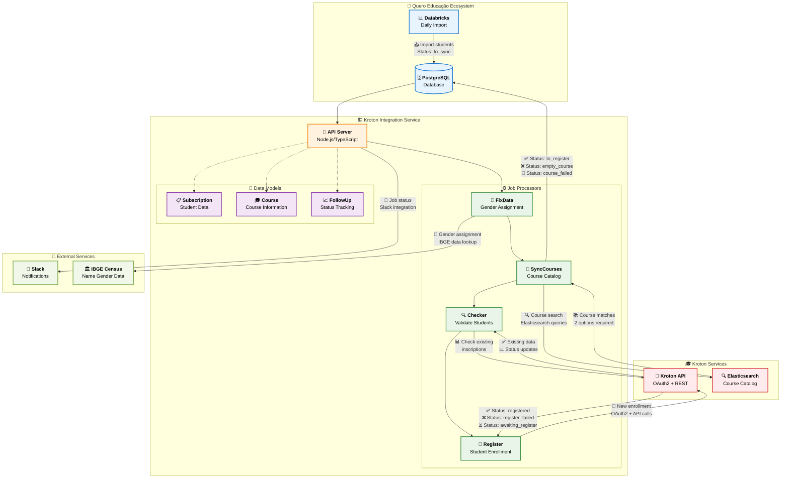
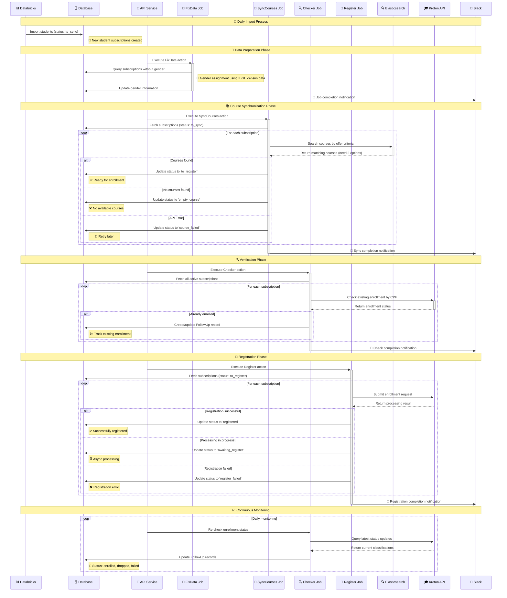
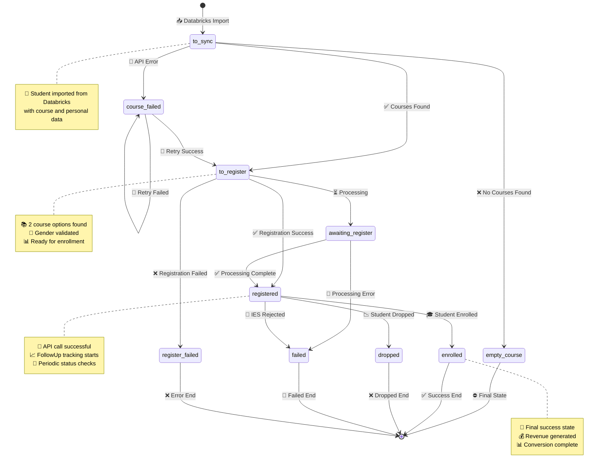

# Integração de Leads da Kroton

## Contents

- [Processo de Inscrição da Kroton](#processo-de-inscrição-da-kroton)
- [Arquitetura](#arquitetura)
- [Perspectivas Alternativas](#perspectivas-alternativas)
- [Lista de IES/integradores com integração ativa](#lista-de-iesintegradores-com-integração-ativa)
- [Esquema de payloads esperados por tipo de evento](#esquema-de-payloads-esperados-por-tipo-de-evento)
- [Padrão de autenticação por tipo de integração](#padrão-de-autenticação-por-tipo-de-integração)
- [Endpoints de envio](#endpoints-de-envio)
- [Regras de negócio por integração ativa](#regras-de-negócio-por-integração-ativa)
- [Definição de eventos mínimos por tipo de ação](#definição-de-eventos-mínimos-por-tipo-de-ação)
- [Formato de resposta esperado das APIs externas](#formato-de-resposta-esperado-das-apis-externas)
- [Status de processamento - follow_ups table](#status-de-processamento---follow_ups-table)
- [References](#references)

## Processo de Inscrição da Kroton

O sistema de integração de leads da Kroton é um serviço Node.js/TypeScript que automatiza o processo de inscrição de alunos no vestibular da Kroton através de sua API oficial. Este sistema faz parte do ecossistema Quero Educação e permite a consulta de ofertas disponíveis e o registro de inscrições de forma automatizada.

O processo começa com a importação diária de dados de alunos que não converteram na Kroton através de um notebook Databricks, seguido por uma série de ações automatizadas: sincronização de cursos via Elasticsearch da Kroton, validação de dados pessoais, verificação de inscrições existentes e, finalmente, o registro de novas inscrições. O sistema mantém controle completo do ciclo de vida das inscrições através de status bem definidos e follow-ups detalhados.

A integração utiliza tanto a API oficial da Kroton quanto seu middleware de catálogo via Elasticsearch, garantindo acesso às ofertas mais atualizadas e respeitando os limites de rate limiting estabelecidos pela instituição (100 requisições a cada 5 minutos).

## Arquitetura



## Perspectivas Alternativas

<details>
<summary><strong>Sequence Diagram - Processo de Inscrição</strong> (Clique para expandir)</summary>



</details>

<details>
<summary><strong>State Diagram - Ciclo de Vida da Inscrição</strong> (Clique para expandir)</summary>



</details>

## Lista de IES/integradores com integração ativa

| Instituição | Tipo de Integração | Status | Observações |
|-------------|-------------------|---------|-------------|
| Kroton | API REST + Middleware | ✅ Ativo | Integração completa com OAuth2 |
| Elasticsearch Kroton | Catálogo de Cursos | ✅ Ativo | Rate limit: 100 req/5min |

**Modalidades Suportadas:**
- **COLABORAR**: Educação a Distância (EAD)
- **OLIMPO**: Presencial

**Ambientes Disponíveis:**
- **Staging**: `https://ingresso-api-stg-portal.krthomolog.com.br`
- **Production**: `https://ingresso-api-portal.kroton.com.br`

## Esquema de payloads esperados por tipo de evento

### Inscrição de Aluno (POST)

```typescript
interface EnrollmentPayload {
  dadosPessoais: {
    celular: string;        // "11975405666"
    cpf: string;           // "378.457.608-70" 
    dataNascimento: string; // "1989-08-31"
    email: string;         // "mauricio.matsoui@redealumni.com"
    endereco: {
      cep: string;         // "12243-740"
      logradouro: string;  // "Rua Pedro de Toledo"
      municipio: string;   // "São José dos Campos"
      numero: string;      // "48"
      uf: string;         // "SP"
    };
    necessidadesEspeciais: any[];
    nome: string;          // "Mauricio Matsoui"
    rg: string;           // "20000000"
    sexo: "M" | "F";      // "M" or "F"
  };
  inscricao: {
    canalVendas: {
      id: number;          // 85
    };
    idAfiliado: string;    // "DL00QUERO12991"
    idTipoProva: number;   // 1
    ofertas: {
      primeiraOpcao: {
        id: string;        // "1093731-446-52505-580-872433-11342-100"
      };
      segundaOpcao?: {
        id: string;        // Optional second option
      };
    };
  };
}
```

### Consulta de Cursos (Elasticsearch)

```typescript
interface CourseSearchPayload {
  query: {
    bool: {
      must: [
        { match: { dsCurso: { query: string; operator: "AND" } } },
        { match: { idUnidadeOrigem: number } },
        { match: { dsTipoCurso: string } },
        { match: { vlMensalidadeDe: number } },
        { match: { ativa: boolean } },
        { match: { dsModalidade: string } },
        { term: { periodoCaptacao: number } },
        { range: { dtTerminoInscricao: { gte: string } } }
      ];
    };
  };
}
```

### Modelo de Dados - Subscription

```typescript
interface Subscription {
  id: number;
  user_name: string;
  cpf: string;
  gender?: string;
  birthday: string;
  sent_at?: string;
  last_check?: string;
  email: string;
  area_code: string;
  phone_number: string;
  address: string;
  // Status possíveis: to_sync, course_failed, empty_course, 
  // to_register, registered, register_failed, dropped, 
  // enrolled, failed, awaiting_register
}
```

## Padrão de autenticação por tipo de integração

### Kroton API - OAuth2

```typescript
interface AuthConfig {
  client_id: string;      // API_KROTON_CLIENT_ID
  client_secret: string;  // API_KROTON_SECRET
  grant_type: "client_credentials";
  scope: string;          // API_KROTON_SUBSCRIPTION
}
```

**Características:**
- Token expira rapidamente
- Rate limit: 100 requisições a cada 5 minutos
- Renovação automática implementada no `krotonService`

### Elasticsearch Middleware

**Staging**: Requer autenticação via Bearer Token
```http
Authorization: Bearer {token}
```

**Production**: Sem autenticação necessária (até 07/01/2022)

## Endpoints de envio

### Kroton API Endpoints

| Endpoint | Método | Descrição |
|----------|---------|-----------|
| `/oauth2/token` | POST | Autenticação OAuth2 |
| `/ms/inscricao/v4/captacao/inscricao/cpf/{cpf}` | GET | Consulta CPF Inscrito |
| `/ms/matricula/captacao/v1/ms/matricula/candidato/cpf/{cpf}` | GET | Consulta CPF Matriculado |
| `/ms/inscricao/v4/captacao/inscricao/{inscricao}/sistema/{sistema}` | GET | Consulta Código de Inscrição |
| `/ms/inscricao/v4/captacao/inscricao` | POST | Inscrição do Aluno |

### Elasticsearch Middleware

| Ambiente | URL Base |
|----------|----------|
| Staging | `https://captacao-aks-stg.krthomolog.com.br/elasticlayer/middleware/oferta/_search` |
| Production | `https://captacao-akS.kroton.com.br/elasticlayer/middleware/oferta/_search` |

## Regras de negócio por integração ativa

### Validações de Inscrição

1. **CPF Único**: Constraint de unicidade na tabela `subscriptions` por CPF
2. **Duas Opções de Curso**: Obrigatório para realizar inscrição
3. **Gender Obrigatório**: Inscrições sem gender são ignoradas no register
4. **Data de Nascimento**: Validação pendente para datas antes de 1900
5. **Campos de Endereço**: Todos obrigatórios conforme API da Kroton

### Rate Limiting

- **Kroton API**: 100 requisições / 5 minutos
- **Implementação**: Chunks com intervalo controlado na classe `Base`
- **Retry Logic**: Implementado para falhas de rede e rate limit

### Status Transitions

```
to_sync → syncCourses → [to_register|empty_course|course_failed]
to_register → register → [registered|register_failed|awaiting_register]
registered → checker → [enrolled|dropped|failed]
```

## Definição de eventos mínimos por tipo de ação

### Actions Disponíveis

| Action | Descrição | Frequência |
|--------|-----------|------------|
| `checker` | Valida alunos matriculados/inscritos | Diária |
| `syncCourses` | Busca ofertas no Elasticsearch | Por demanda |
| `register` | Inscreve leads no vestibular | Por demanda |
| `fixData` | Adiciona gender via IBGE census | Por demanda |
| `allJobs` | Executa todas as actions | Automática |

### Eventos de Sistema

1. **Import Event**: Databricks → Database (daily)
2. **Sync Event**: Course catalog synchronization
3. **Register Event**: Student enrollment submission
4. **Check Event**: Status verification and updates
5. **Notification Event**: Slack alerts for job status

## Formato de resposta esperado das APIs externas

### Kroton API - Inscrição Response

```typescript
interface EnrollmentResponse {
  success: boolean;
  inscricaoId?: string;
  status: "NEW" | "PROCESSING" | "ERROR" | "SUCCESS";
  message?: string;
  errors?: string[];
}
```

### Kroton API - Consulta CPF Response

```typescript
interface CPFQueryResponse {
  inscricoes: Array<{
    id: string;
    classificacao: {
      descricao: "Convocado" | "Classificado" | "Aluno" | 
                "Inscrito" | "Itinerante" | "Inscrito VG Online" | 
                "Ausente";
    };
    curso: string;
    unidade: string;
    status: string;
  }>;
}
```

### Elasticsearch - Course Search Response

```typescript
interface CourseSearchResponse {
  hits: {
    total: { value: number };
    hits: Array<{
      _source: {
        id: string;
        dsCurso: string;
        dsTipoCurso: string;
        dsModalidade: string;
        vlMensalidadeDe: number;
        dtTerminoInscricao: string;
        ativa: boolean;
        periodoCaptacao: number;
        sistema: "COLABORAR" | "OLIMPO";
      };
    }>;
  };
}
```

## Status de processamento - follow_ups table

### Classificações da Kroton (source.inscricao.classificacao.descricao)

| Status Kroton | Status Interno | Descrição |
|---------------|----------------|-----------|
| **Aluno** | `enrolled` | ✅ Matriculado (aprovado + pagamento efetuado) |
| **Convocado** | `enrolled` | 🎯 Aprovado e convocado para matrícula |
| **Classificado** | `registered` | 📝 Aprovado em vestibular |
| **Inscrito** | `registered` | 📋 Inscrição realizada |
| **Itinerante** | `registered` | 🚶 Ingressante por vestibular |
| **Inscrito VG Online** | `registered` | 💻 Inscrito para prova online |
| **Ausente** | `dropped` | ❌ Faltou na prova agendada |
| **Desclassificado** | `dropped` | ❌ Não aprovado no processo |

### Status de Processamento Assíncrono

| Status API | Status Interno | Descrição |
|------------|----------------|-----------|
| **NEW** | `awaiting_register` | ⏳ Inscrição em fila de processamento |
| **PROCESSING** | `awaiting_register` | 🔄 Processamento em andamento |
| **ERROR** | `failed` | 🚫 Erro no processamento |
| **SUCCESS** | `registered` | ✅ Processamento concluído |

### Estrutura da Tabela FollowUp

```typescript
interface FollowUp {
  id: number;
  kroton_subscription_id?: number;
  kroton_subscription_dealer_id?: string;
  source: any; // JSON com dados completos da Kroton
  subscription: Subscription;
  created_at: Date;
  updated_at: Date;
}
```

## References

- **GitHub Repository**: [https://github.com/quero-edu/kroton-lead-integration](https://github.com/quero-edu/kroton-lead-integration)
- **Kroton API Documentation**: 
  - Staging: https://ingresso-api-stg-portal.krthomolog.com.br/products/Ingresso
  - Production: https://ingresso-api-portal.kroton.com.br/products/Ingresso
- **Databricks Notebook**: [Daily Import Process](https://dbc-cd62f9f0-a95c.cloud.databricks.com/?o=7804433505040691#notebook/2344378349282606/command/2344378349282607)
- **Quero Boot**: [Development Environment](https://github.com/quero-edu/quero-boot)
- **TypeScript**: v14.17.6 Runtime Environment
- **TypeORM**: Database ORM and Migration System
- **Docker**: Containerization and Local Development