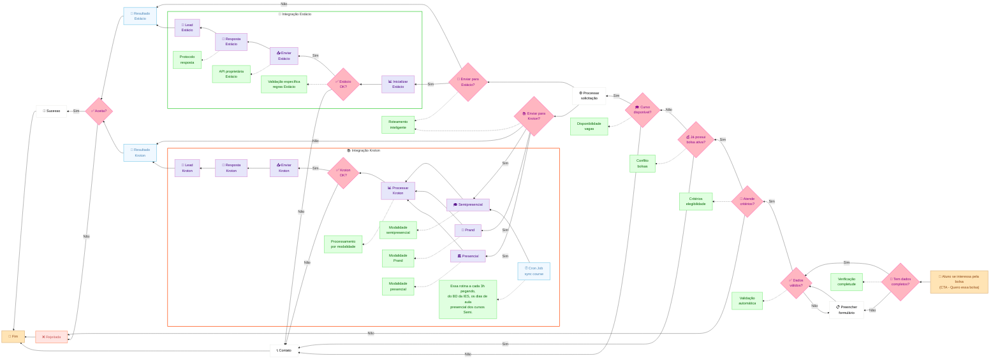

# Fluxo de Inscrições

```mermaid
flowchart RL
    %% Definindo classes CSS abrangentes para estilização
    classDef startEnd fill:#FFE4B5,stroke:#DEB887,stroke-width:2px,color:#8B4513
    classDef decision fill:#FFB6C1,stroke:#FF69B4,stroke-width:2px,color:#8B008B
    classDef comment fill:#E0FFE0,stroke:#90EE90,stroke-width:2px,color:#006400
    classDef action fill:#FFFFFF,stroke:#E2E4DF,stroke-width:1px,color:#000000
    classDef integration fill:#E6E6FA,stroke:#DDA0DD,stroke-width:2px,color:#4B0082
    classDef system fill:#F0F8FF,stroke:#87CEEB,stroke-width:2px,color:#4682B4
    classDef warning fill:#FFE4E1,stroke:#FFA07A,stroke-width:2px,color:#CD5C5C
    
    %% Início do fluxo - nó inicial (oval amarelo)
    START["🎯 Aluno se interessa pela bolsa<br/>(CTA - Quero essa bolsa)"]:::startEnd
    
    %% Primeira sequência de validações e decisões (diamantes rosa)
    D1{"📝 Tem dados<br/>completos?"}:::decision
    FORM["📋 Preencher<br/>formulário"]:::action
    
    D2{"✅ Dados<br/>válidos?"}:::decision
    
    D3{"🎯 Atende<br/>critérios?"}:::decision
    
    D4{"💰 Já possui<br/>bolsa ativa?"}:::decision
    
    D5{"🎓 Curso<br/>disponível?"}:::decision
    
    %% Processamento principal
    PROCESS["⚙️ Processar<br/>solicitação"]:::action
    
    %% Decisões de roteamento para sistemas
    D6{"🏫 Enviar para<br/>Estácio?"}:::decision
    D7{"📚 Enviar para<br/>Kroton?"}:::decision
    
    %% Subgrafo para fluxo Estácio
    subgraph ESTACIO ["🏫 Integração Estácio"]
        EST_INIT["📊 Inicializar<br/>Estácio"]:::integration
        EST_VALID{"✅ Estácio<br/>OK?"}:::decision
        EST_SEND["📤 Enviar<br/>Estácio"]:::integration
        EST_RESPONSE["📨 Resposta<br/>Estácio"]:::integration
        EST_LEAD["👤 Lead<br/>Estácio"]:::integration
        
        %% Comentários Estácio (caixas verdes)
        EST_C1["Validação específica<br/>regras Estácio"]:::comment
        EST_C2["API proprietária<br/>Estácio"]:::comment
        EST_C3["Protocolo<br/>resposta"]:::comment
    end
    
    %% Subgrafo para fluxo Kroton com modalidades específicas
    subgraph KROTON ["📚 Integração Kroton"]
        KRO_SEMI["🎓 Semipresencial"]:::integration
        KRO_PRAND["🏢 Prand"]:::integration
        KRO_PRES["🏛️ Presencial"]:::integration
        
        %% Cron Job que estava faltando
        CRON_JOB["⏰ Cron Job<br/>sync course"]:::system
        
        KRO_PROC["📊 Processar<br/>Kroton"]:::integration
        KRO_VALID{"✅ Kroton<br/>OK?"}:::decision
        KRO_SEND["📤 Enviar<br/>Kroton"]:::integration
        KRO_RESPONSE["📨 Resposta<br/>Kroton"]:::integration
        KRO_LEAD["👤 Lead<br/>Kroton"]:::integration
        
        %% Comentários Kroton (caixas verdes) incluindo o do Cron Job
        KRO_C1["Modalidade<br/>semipresencial"]:::comment
        KRO_C2["Modalidade<br/>Prand"]:::comment
        KRO_C3["Modalidade<br/>presencial"]:::comment
        KRO_C4["Processamento<br/>por modalidade"]:::comment
        CRON_COMMENT["Essa rotina a cada 3h pegando,<br/>do BD da IES, os dias de aula<br/>presencial dos cursos Semi."]:::comment
    end
    
    %% Convergência e resultados
    CONV_EST["🔄 Resultado<br/>Estácio"]:::system
    CONV_KRO["🔄 Resultado<br/>Kroton"]:::system
    FINAL_CHECK{"✅ Aceita?"}:::decision
    
    %% Nós de resultado final
    SUCCESS["🎉 Sucesso"]:::action
    REJECT["❌ Rejeitada"]:::warning
    CONTACT["📞 Contato"]:::action
    
    %% Comentários principais (caixas verdes - 6 restantes)
    C1["Verificação<br/>completude"]:::comment
    C2["Validação<br/>automática"]:::comment
    C3["Critérios<br/>elegibilidade"]:::comment
    C4["Conflito<br/>bolsas"]:::comment
    C5["Disponibilidade<br/>vagas"]:::comment
    C6["Roteamento<br/>inteligente"]:::comment
    
    %% Nó final (oval amarelo)
    END["🏁 Fim"]:::startEnd
    
    %% Fluxo principal de validações
    START --> D1
    D1 -->|Não| FORM
    D1 -->|Sim| D2
    FORM --> D2
    
    D2 -->|Não| FORM
    D2 -->|Sim| D3
    
    D3 -->|Não| REJECT
    D3 -->|Sim| D4
    
    D4 -->|Sim| CONTACT
    D4 -->|Não| D5
    
    D5 -->|Não| CONTACT
    D5 -->|Sim| PROCESS
    
    %% Distribuição para sistemas
    PROCESS --> D6
    PROCESS --> D7
    
    %% Fluxo completo Estácio
    D6 -->|Sim| EST_INIT
    D6 -->|Não| CONV_EST
    EST_INIT --> EST_VALID
    EST_VALID -->|Sim| EST_SEND
    EST_VALID -->|Não| CONTACT
    EST_SEND --> EST_RESPONSE
    EST_RESPONSE --> EST_LEAD
    EST_LEAD --> CONV_EST
    
    %% Fluxo completo Kroton com modalidades
    D7 -->|Sim| KRO_SEMI
    D7 -->|Sim| KRO_PRAND
    D7 -->|Sim| KRO_PRES
    D7 -->|Não| CONV_KRO
    
    %% Cron Job conectado às modalidades Kroton
    CRON_JOB --> KRO_SEMI
    
    KRO_SEMI --> KRO_PROC
    KRO_PRAND --> KRO_PROC
    KRO_PRES --> KRO_PROC
    KRO_PROC --> KRO_VALID
    KRO_VALID -->|Sim| KRO_SEND
    KRO_VALID -->|Não| CONTACT
    KRO_SEND --> KRO_RESPONSE
    KRO_RESPONSE --> KRO_LEAD
    KRO_LEAD --> CONV_KRO
    
    %% Convergência e resultado final
    CONV_EST --> FINAL_CHECK
    CONV_KRO --> FINAL_CHECK
    
    FINAL_CHECK -->|Sim| SUCCESS
    FINAL_CHECK -->|Não| REJECT
    
    %% Caminhos finais para o fim
    SUCCESS --> END
    REJECT --> END
    CONTACT --> END
    
    %% Conexões dos comentários (linhas pontilhadas - total 13 comentários)
    D1 -.-> C1
    D2 -.-> C2
    D3 -.-> C3
    D4 -.-> C4
    D5 -.-> C5
    D6 -.-> C6
    D7 -.-> C6
    
    EST_VALID -.-> EST_C1
    EST_SEND -.-> EST_C2
    EST_RESPONSE -.-> EST_C3
    
    KRO_SEMI -.-> KRO_C1
    KRO_PRAND -.-> KRO_C2
    KRO_PRES -.-> KRO_C3
    KRO_PROC -.-> KRO_C4
    CRON_JOB -.-> CRON_COMMENT
    
    %% Estilização dos subgrafos sem background para não ocultar linhas
    style ESTACIO fill:transparent,stroke:#32CD32,stroke-width:2px
    style KROTON fill:transparent,stroke:#FF4500,stroke-width:2px
```