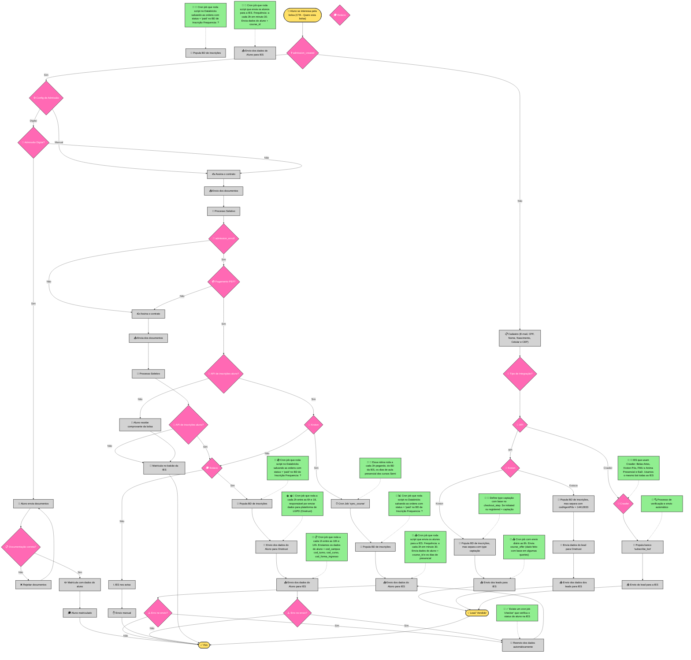

# Fluxo de Inscrições - Sistema Integrado QueroEdu

## Descrição do Processo

Este diagrama representa o **fluxo completo de inscrições** do ecossistema QueroEdu, desde o interesse inicial do aluno até a finalização da matrícula ou captação de leads. O processo contempla múltiplas modalidades de integração com diferentes Instituições de Ensino Superior (IES), incluindo integrações diretas via API, processamento por crawler e envios manuais.

### Principais Características:

- **🎯 Processo Unificado**: Consolida diferentes jornadas do aluno em um fluxo único
- **🔄 Integrações Automatizadas**: APIs diretas com instituições parceiras
- **📊 Controle de Status**: Rastreamento completo do ciclo de vida das inscrições
- **🤖 Processamento em Lote**: Jobs automatizados para sincronização e envio de dados
- **📋 Conformidade LGPD**: Integração obrigatória com plataformas de compliance

### Integrações Contempladas:

#### 🏫 Integração Kroton
Para detalhes completos sobre a integração Kroton, consulte: [Kroton Lead Integration](kroton-lead-integration.md)
- **Modalidades**: Presencial e Semi-presencial 
- **Tecnologia**: API REST + OAuth2 + Elasticsearch
- **Características**: Rate limiting (100 req/5min), sincronização de cursos automática
- **Jobs**: `sync_course`, populamento de BD, envio automático de dados

#### 🎓 Integração Estácio
Para detalhes completos sobre a integração Estácio, consulte: [Estácio Lead Integration](estacio-lead-integration.md)
- **Compliance**: Integração obrigatória com OneTrust (LGPD)
- **Tecnologia**: API Direta + OneTrust
- **Características**: Processamento em chunks, retry automático
- **Jobs**: Sync LGPD (a cada 2h), registro de inscrições (10h-14h UTC)

#### 🤖 Integração via Crawler
- **IES Atendidas**: Belas Artes, Kroton Pós, FMU, Anima (Presencial e EaD)
- **Tecnologia**: Bot automatizado único para todas as IES
- **Processo**: Populamento do banco `subscribe_bot` + envio automatizado

### Fluxos de Processo:

1. **💳 Fluxo PEF (Pagamento)**: Processo completo com admissão digital e validação de documentos
2. **🔄 Fluxo de Integração**: Direcionamento baseado no tipo de integração disponível
3. **📝 Fluxo de Captação**: Geração e envio de leads para IES parceiras
4. **⚠️ Fluxo de Erro**: Tratamento e reenvio automático em caso de falhas

---

## Referências Técnicas

- **[Kroton Lead Integration](kroton-lead-integration.md)**: Documentação completa da integração com APIs Kroton, incluindo OAuth2, Elasticsearch e processamento de matrículas
- **[Estácio Lead Integration](estacio-lead-integration.md)**: Documentação detalhada da integração Estácio com compliance LGPD via OneTrust
- **Databricks**: Importação diária de dados de alunos e ordens
- **APIs de Terceiros**: Integrações diretas com sistemas das IES parceiras