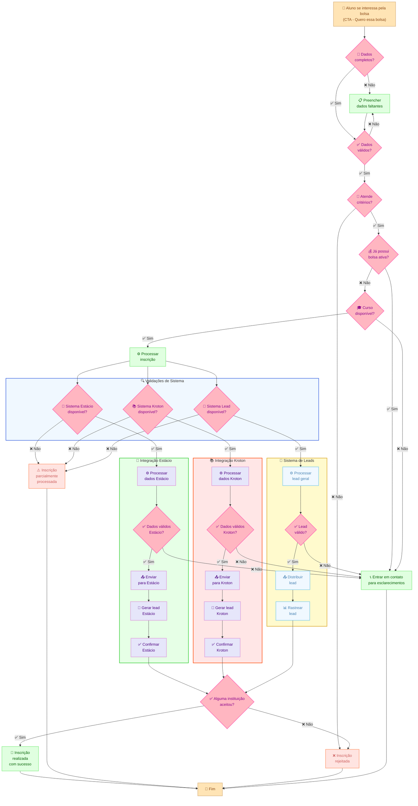

# Fluxo de Inscrições

```mermaid
flowchart TD
    %% Definindo classes de estilo com cores pastel
    classDef startEnd fill:#FFE4B5,stroke:#DEB887,stroke-width:2px,color:#8B4513
    classDef decision fill:#FFB6C1,stroke:#FF69B4,stroke-width:2px,color:#8B008B
    classDef process fill:#E0FFE0,stroke:#90EE90,stroke-width:2px,color:#006400
    classDef integration fill:#E6E6FA,stroke:#DDA0DD,stroke-width:2px,color:#4B0082
    classDef system fill:#F0F8FF,stroke:#87CEEB,stroke-width:2px,color:#4682B4
    classDef warning fill:#FFE4E1,stroke:#FFA07A,stroke-width:2px,color:#CD5C5C
    
    %% Início do fluxo
    START["🎯 Aluno se interessa pela bolsa<br/>(CTA - Quero essa bolsa)"]:::startEnd
    
    %% Primeira sequência de validações
    D1{"📝 Dados<br/>completos?"}:::decision
    FORM["📋 Preencher<br/>dados faltantes"]:::process
    
    D2{"✅ Dados<br/>válidos?"}:::decision
    
    D3{"🎯 Atende<br/>critérios?"}:::decision
    
    D4{"💰 Já possui<br/>bolsa ativa?"}:::decision
    
    D5{"🎓 Curso<br/>disponível?"}:::decision
    
    %% Processamento principal
    PROC["⚙️ Processar<br/>inscrição"]:::process
    
    %% Subgrafo para validações de sistema
    subgraph VALIDACOES ["🔍 Validações de Sistema"]
        SYS_CHECK1{"🏫 Sistema Estácio<br/>disponível?"}:::decision
        SYS_CHECK2{"📚 Sistema Kroton<br/>disponível?"}:::decision
        SYS_CHECK3{"🔄 Sistema Lead<br/>disponível?"}:::decision
    end
    
    %% Subgrafo para integrações Estácio
    subgraph ESTACIO ["🏫 Integração Estácio"]
        EST_PROC["⚙️ Processar<br/>dados Estácio"]:::integration
        EST_VALID{"✅ Dados válidos<br/>Estácio?"}:::decision
        EST_SEND["📤 Enviar<br/>para Estácio"]:::integration
        EST_LEAD["👤 Gerar lead<br/>Estácio"]:::integration
        EST_CONFIRM["✅ Confirmar<br/>Estácio"]:::integration
    end
    
    %% Subgrafo para integrações Kroton
    subgraph KROTON ["📚 Integração Kroton"]
        KRO_PROC["⚙️ Processar<br/>dados Kroton"]:::integration
        KRO_VALID{"✅ Dados válidos<br/>Kroton?"}:::decision
        KRO_SEND["📤 Enviar<br/>para Kroton"]:::integration
        KRO_LEAD["👤 Gerar lead<br/>Kroton"]:::integration
        KRO_CONFIRM["✅ Confirmar<br/>Kroton"]:::integration
    end
    
    %% Subgrafo para sistema de leads
    subgraph LEADS ["🔄 Sistema de Leads"]
        LEAD_PROC["⚙️ Processar<br/>lead geral"]:::system
        LEAD_VALID{"✅ Lead<br/>válido?"}:::decision
        LEAD_SEND["📤 Distribuir<br/>lead"]:::system
        LEAD_TRACK["📊 Rastrear<br/>lead"]:::system
    end
    
    %% Validação final e resultados
    FINAL_CHECK{"✅ Alguma instituição<br/>aceitou?"}:::decision
    
    SUCCESS["🎉 Inscrição<br/>realizada<br/>com sucesso"]:::process
    PARTIAL["⚠️ Inscrição<br/>parcialmente<br/>processada"]:::warning
    REJECT["❌ Inscrição<br/>rejeitada"]:::warning
    CONTACT["📞 Entrar em contato<br/>para esclarecimentos"]:::process
    
    %% Final
    END["🏁 Fim"]:::startEnd
    
    %% Fluxo principal
    START --> D1
    D1 -->|❌ Não| FORM
    D1 -->|✅ Sim| D2
    FORM --> D2
    
    D2 -->|❌ Não| FORM
    D2 -->|✅ Sim| D3
    
    D3 -->|❌ Não| REJECT
    D3 -->|✅ Sim| D4
    
    D4 -->|✅ Sim| CONTACT
    D4 -->|❌ Não| D5
    
    D5 -->|❌ Não| CONTACT
    D5 -->|✅ Sim| PROC
    
    %% Distribuição para sistemas
    PROC --> SYS_CHECK1
    PROC --> SYS_CHECK2
    PROC --> SYS_CHECK3
    
    %% Fluxo Estácio
    SYS_CHECK1 -->|✅ Sim| EST_PROC
    SYS_CHECK1 -->|❌ Não| PARTIAL
    EST_PROC --> EST_VALID
    EST_VALID -->|✅ Sim| EST_SEND
    EST_VALID -->|❌ Não| CONTACT
    EST_SEND --> EST_LEAD
    EST_LEAD --> EST_CONFIRM
    
    %% Fluxo Kroton
    SYS_CHECK2 -->|✅ Sim| KRO_PROC
    SYS_CHECK2 -->|❌ Não| PARTIAL
    KRO_PROC --> KRO_VALID
    KRO_VALID -->|✅ Sim| KRO_SEND
    KRO_VALID -->|❌ Não| CONTACT
    KRO_SEND --> KRO_LEAD
    KRO_LEAD --> KRO_CONFIRM
    
    %% Fluxo Sistema de Leads
    SYS_CHECK3 -->|✅ Sim| LEAD_PROC
    SYS_CHECK3 -->|❌ Não| PARTIAL
    LEAD_PROC --> LEAD_VALID
    LEAD_VALID -->|✅ Sim| LEAD_SEND
    LEAD_VALID -->|❌ Não| CONTACT
    LEAD_SEND --> LEAD_TRACK
    
    %% Convergência final
    EST_CONFIRM --> FINAL_CHECK
    KRO_CONFIRM --> FINAL_CHECK
    LEAD_TRACK --> FINAL_CHECK
    
    %% Resultados finais
    FINAL_CHECK -->|✅ Sim| SUCCESS
    FINAL_CHECK -->|❌ Não| REJECT
    
    SUCCESS --> END
    PARTIAL --> END
    REJECT --> END
    CONTACT --> END
    
    %% Estilização dos subgrafos
    style VALIDACOES fill:#F0F8FF,stroke:#4169E1,stroke-width:2px
    style ESTACIO fill:#E6FFE6,stroke:#32CD32,stroke-width:2px
    style KROTON fill:#FFE6E6,stroke:#FF4500,stroke-width:2px
    style LEADS fill:#FFFACD,stroke:#DAA520,stroke-width:2px
```
