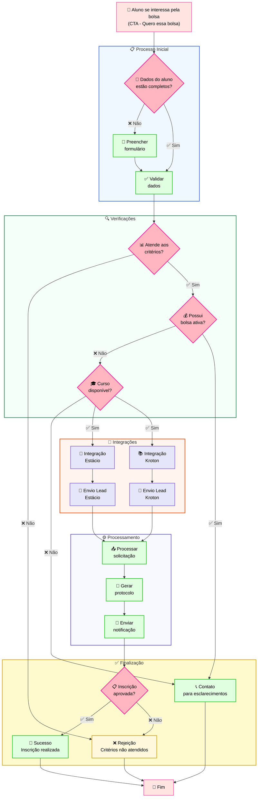

# Fluxo de Inscrições 📝

Este diagrama representa o fluxo completo do processo de inscrições, desde o interesse inicial do aluno até a finalização do processo.

## 📝 Descrição do Fluxo

### 🎯 Início
O processo inicia quando o aluno demonstra interesse pela bolsa através do CTA "Quero essa bolsa".

### 📋 Processo Inicial
1. **Verificação de dados**: Verifica se os dados do aluno estão completos
2. **Preenchimento de formulário**: Caso necessário, solicita preenchimento de dados faltantes
3. **Validação**: Valida os dados fornecidos

### 🔍 Verificações
- **Critérios**: Verifica se o aluno atende aos critérios estabelecidos
- **Bolsa ativa**: Confirma se não possui bolsa ativa
- **Disponibilidade do curso**: Verifica se o curso está disponível

### 🔗 Integrações
O sistema integra com:
- **Estácio**: Envio de leads para a instituição Estácio
- **Kroton**: Envio de leads para a instituição Kroton

### ⚙️ Processamento
1. **Processamento da solicitação**: Processa os dados da inscrição
2. **Geração de protocolo**: Cria protocolo de acompanhamento
3. **Envio de notificação**: Notifica o aluno sobre o status

### ✅ Finalização
- **Aprovação**: Inscrição aprovada com sucesso
- **Rejeição**: Inscrição rejeitada por não atender critérios
- **Contato**: Necessidade de esclarecimentos adicionais

### 🏁 Fim
Término do processo de inscrição.

---

*Este fluxo representa o processo completo de inscrições, garantindo que todas as etapas sejam seguidas corretamente e que as integrações funcionem adequadamente.*
