# Fluxo de Inscrições - Diagrama de Processo

## Visão Geral
Este documento apresenta o fluxo completo do processo de inscrições, convertido do diagrama original para formato Mermaid para facilitar manutenção e versionamento.

## Diagrama do Fluxo de Inscrições

```mermaid
flowchart TD
    Start([🚀 Início]) --> Decision1{🤔 Decisão 1}
    
    %% Entrada e Validação Inicial
    subgraph "🔍 Validação de Entrada"
        Decision1 -->|✅ Sim| Process1[⚙️ Processo 1]
        Decision1 -->|❌ Não| Decision2{📋 Validação Inicial}
        Process1 --> Decision3{📝 Tipo de Inscrição}
        Decision2 -->|✅ Válido| Decision3
        Decision2 -->|⚠️ Inválido| Error1[❌ Erro - Dados Inválidos]
    end
    
    %% Processamento Tipo A
    subgraph "🔵 Fluxo Inscrição Tipo A"
        Decision3 -->|🅰️ Tipo A| ProcessA[🔄 Processar Tipo A]
        ProcessA --> API1[📡 API Call 1]
        API1 --> API2[📡 API Call 2]
        API2 --> API3[📡 API Call 3]
        API3 --> Decision4{🔍 Status OK?}
        Decision4 -->|✅ Sim| Success1[🎉 Sucesso A]
        Decision4 -->|🔄 Não| Retry1[🔁 Tentar Novamente]
        Retry1 --> API1
    end
    
    %% Processamento Tipo B
    subgraph "🟢 Fluxo Inscrição Tipo B"
        Decision3 -->|🅱️ Tipo B| ProcessB[🔄 Processar Tipo B]
        ProcessB --> Decision5{✅ Validação B}
        Decision5 -->|✅ Válido| API4[📡 API Call B1]
        Decision5 -->|⚠️ Inválido| Error2[❌ Erro Tipo B]
        API4 --> API5[📡 API Call B2]
        API5 --> Success2[🎉 Sucesso B]
    end
    
    %% Processamento Tipo C (Caso exista)
    subgraph "🟣 Fluxo Inscrição Tipo C"
        Decision3 -->|🅲 Tipo C| ProcessC[🔄 Processar Tipo C]
        ProcessC --> API6[📡 API Call C1]
        API6 --> Decision6{🔎 Verificação}
        Decision6 -->|✅ Aprovado| API7[📡 API Call C2]
        Decision6 -->|❌ Rejeitado| Error3[❌ Erro Tipo C]
        API7 --> Success3[🎉 Sucesso C]
    end
    
    %% Fluxos Especiais
    subgraph "⭐ Processamento Especial"
        Decision1 -->|🔀 Fluxo Alternativo| Decision7{🎯 Condição Especial}
        Decision7 -->|✅ Sim| Decision8{🔍 Sub-condição 1}
        Decision7 -->|❌ Não| Decision9{🔍 Sub-condição 2}
        
        Decision8 -->|🅰️ A| API8[📡 API Especial A]
        Decision8 -->|🅱️ B| API9[📡 API Especial B]
        Decision9 -->|❌ X| ProcessX[⚙️ Processo X]
        Decision9 -->|🆈 Y| ProcessY[⚙️ Processo Y]
        
        API8 --> Success4[🎉 Sucesso Especial A]
        API9 --> Success5[🎉 Sucesso Especial B]
        ProcessX --> Decision10{🏁 Final X?}
        ProcessY --> Decision11{🏁 Final Y?}
        
        Decision10 -->|✅ Sim| Success6[🎉 Sucesso X]
        Decision10 -->|❌ Não| Error4[❌ Erro X]
        Decision11 -->|✅ Sim| Success7[🎉 Sucesso Y]
        Decision11 -->|❌ Não| Error5[❌ Erro Y]
    end
    
    %% Finalização
    subgraph "🏆 Estados Finais"
        Success1 --> End([🏁 Fim])
        Success2 --> End
        Success3 --> End
        Success4 --> End
        Success5 --> End
        Success6 --> End
        Success7 --> End
        Error1 --> End
        Error2 --> End
        Error3 --> End
        Error4 --> End
        Error5 --> End
    end
    
    %% Styling - Pastel Colors
    classDef startEnd fill:#FFF8DC,stroke:#DDA0DD,stroke-width:3px,color:#8B4513
    classDef decision fill:#FFEEE6,stroke:#FFB6C1,stroke-width:2px,color:#8B0000
    classDef process fill:#F0F8FF,stroke:#B0E0E6,stroke-width:2px,color:#4169E1
    classDef api fill:#F0FFF0,stroke:#90EE90,stroke-width:2px,color:#228B22
    classDef success fill:#F5FFFA,stroke:#98FB98,stroke-width:3px,color:#006400
    classDef error fill:#FFF0F5,stroke:#FFB6C1,stroke-width:2px,color:#DC143C
    classDef special fill:#F8F8FF,stroke:#DDA0DD,stroke-width:2px,color:#9370DB
    
    class Start,End startEnd
    class Decision1,Decision2,Decision3,Decision4,Decision5,Decision6,Decision7,Decision8,Decision9,Decision10,Decision11 decision
    class Process1,ProcessA,ProcessB,ProcessC,ProcessX,ProcessY process
    class API1,API2,API3,API4,API5,API6,API7,API8,API9 api
    class Success1,Success2,Success3,Success4,Success5,Success6,Success7 success
    class Error1,Error2,Error3,Error4,Error5 error
```

## Descrição dos Componentes

### 🚀 Pontos de Início e Fim (Losangos Creme)
- **🚀 Início**: Ponto de entrada do fluxo de inscrições
- **🏁 Fim**: Ponto final unificado para todos os fluxos

### 🤔 Pontos de Decisão (Losangos Rosa Pastel)
- **🤔 Decisão 1**: Ponto de entrada principal do fluxo
- **📋 Validação Inicial**: Validação inicial dos dados
- **📝 Tipo de Inscrição**: Classificação do tipo de inscrição
- **🔍 Validações Específicas**: Validações específicas por tipo de processo

### ⚙️ Processos (Retângulos Azul Pastel)
- **⚙️ Processo 1**: Processamento inicial
- **🔄 Processamento A/B/C**: Processamento específico por tipo
- **⚙️ Processos X/Y**: Processos alternativos

### 📡 APIs/Integrações (Retângulos Verde Pastel)
- **📡 API Calls 1-9**: Chamadas para sistemas externos
- Representam integrações com sistemas de terceiros
- Incluem validações, envio de dados e confirmações

### Estados Finais
- **🎉 Success 1-7**: Estados de sucesso para cada fluxo
- **❌ Error 1-5**: Estados de erro com diferentes causas
- **🏁 End**: Ponto final unificado

## Regras de Negócio Identificadas

1. **Validação Múltipla**: O sistema possui várias camadas de validação
2. **Tipos de Inscrição**: Diferentes tipos (A, B, C) com fluxos específicos
3. **Retry Logic**: Sistema de retry para falhas em APIs
4. **Fluxos Alternativos**: Caminhos especiais para condições específicas
5. **Convergência**: Todos os fluxos convergem para um ponto final comum

## Integrações Identificadas

Com base no diagrama, o sistema integra com:
- APIs externas para validação de dados
- Sistemas de processamento de inscrições
- Serviços de verificação e aprovação
- APIs de confirmação e notificação

## Próximos Passos

1. Mapear as APIs específicas mencionadas no diagrama
2. Documentar os payloads de cada integração
3. Definir os códigos de erro e success
4. Especificar os tempos de timeout e retry
5. Documentar os tipos de inscrição (A, B, C)

---

*Diagrama convertido do arquivo original `fluxo_inscricoes.pdf` para formato Mermaid*