# 🎓 Fluxo de Inscrições QueroEdu

## 📋 Visão Geral

Este documento detalha o fluxo completo de inscrições do sistema QueroEdu, incluindo processos de matrícula, integração com APIs de parceiros e geração de leads para Instituições de Ensino Superior (IES).

### 🔧 Integrações Disponíveis

#### 🏫 Integração Kroton 
Para detalhes completos sobre a integração Kroton, consulte: [Kroton Lead Integration](kroton-lead-integration.md)
- **Tecnologia**: API REST + OAuth2 + Elasticsearch
- **Características**: Rate limiting (100 req/5min), sincronização de cursos automática
- **Jobs**: `sync_course`, populamento de BD, envio automático de dados

#### 🎓 Integração Estácio
Para detalhes completos sobre a integração Estácio, consulte: [Estácio Lead Integration](estacio-lead-integration.md)
- **Compliance**: Integração obrigatória com OneTrust (LGPD)
- **Tecnologia**: API Direta + OneTrust
- **Características**: Processamento em chunks, retry automático
- **Jobs**: Sync LGPD (a cada 2h), registro de inscrições (10h-14h UTC)

#### 🤖 Integração via Crawler
- **IES Atendidas**: Belas Artes, Kroton Pós, FMU, Anima (Presencial e EaD)
- **Tecnologia**: Bot automatizado único para todas as IES
- **Processo**: Populamento do banco `subscribe_bot` + envio automatizado

### Fluxos de Processo:

1. **💳 Fluxo PEF (Pagamento)**: Processo completo com admissão digital e validação de documentos
2. **🔄 Fluxo de Integração**: Direcionamento baseado no tipo de integração disponível
3. **📝 Fluxo de Captação**: Geração e envio de leads para IES parceiras
4. **⚠️ Fluxo de Erro**: Tratamento e reenvio automático em caso de falhas

```mermaid
flowchart LR
    %% 💬 Green comment nodes based on the image
    COMMENT1["📝 🔄 Essa rotina roda a cada 3h pegando, do BD da IES, os dias de aula presencial dos cursos Semi"]
    COMMENT2["📝 📊 Cron job que roda script no Databricks salvando as ordens com status = 'paid' no BD de Inscrição Frequencia: ?"]
    COMMENT3["📝 📤 Cron job que roda script que envia os alunos para a IES. Frequência: a cada 3h em minuto 30. Envia dados do aluno + course_id e os dias de presencial"]
    COMMENT4["📝 💾 Cron job que roda script no Databricks salvando as ordens com status = 'paid' no BD de Inscrição Frequencia: ?"]
    COMMENT5["📝 🚀 Cron job que roda script que envia os alunos para a IES. Frequência: a cada 3h em minuto 30. Envia dados do aluno + course_id"]
    COMMENT6["📝 ✅ Existe um cron job 'checker' que verifica o status do aluno na IES"]
    COMMENT7["📝 💿 Cron job que roda script no Databricks salvando as ordens com status = 'paid' no BD de Inscrição Frequencia: ?"]
    COMMENT8["📝 🔐 Cron job que roda a cada 2h entre as 6h e 18h, responsável por enviar dados para plataforma de LGPD (Onetrust)"]
    COMMENT9["📝 📋 Cron job que roda a cada 1h entre as 10h e 14h. Enviamos os dados do aluno + cod_campus cod_turno, cod_curso, cod_forma_ingresso"]
    COMMENT10["📝 🎯 Define type captação com base no checkout_step. Se initiated ou registered = captação"]
    COMMENT11["📝 📤 Cron job com envio diário as 8h. Envia course_offer (dado feito com base em algumas queries)"]
    COMMENT12["📝 🤖 IES que usam Crawler: Belas Artes, Kroton Pós, FMU e Anima Presencial e EaD. Usamos o mesmo bot todas as IES"]
    COMMENT13["📝 🔍 Processo de verificação e envio automático"]

    %% Start and End nodes
    INICIO(["🚀 Aluno se interessa pela bolsa (CTA - Quero esta bolsa)"])
    FIM(["✅ Fim"])
    LEAD(["💡 Lead 'Vendido'"])
    
    %% Subgraph for Initial Process
    subgraph SG1 ["🚀 Processo Inicial"]
        AC7["� Cadastro (E-mail, CPF, Nome, Nascimento, Celular e CEP)"]
        IF4{"💳 Pagamento PEF?"}
    end
    
    %% Subgraph for Digital Admission Flow  
    subgraph SG2 ["🔐 Fluxo Admissão Digital"]
        IF5{"🔐 Admissão Digital?"}
        IF6{"🔌 API de inscrições aluno?"}
        AC8["📄 Aluno envia documentos"]
        IF7{"📋 Documentação correta?"}
        AC9["❌ Rejeitar documentos"]
    end
    
    %% Subgraph for Manual Admission Process
    subgraph SG3 ["✍️ Processo Manual de Admissão"]
        IF1{"❓ admission_created"}
        IF2{"⚙️ Config de Admissão"}
        AC1["✍️ Assina o contrato"]
        AC2["📤 Envio dos documentos"]
        AC3["🎯 Processo Seletivo"]
        IF3{"📝 admission_enroll"}
    end
    
    %% Subgraph for Alternative Manual Process
    subgraph SG4 ["✋ Processo Manual Alternativo"]
        AC4["✍️ Assina o contrato"]
        AC5["📤 Envia dos documentos"]
        AC6["🎯 Processo Seletivo"]
    end
    
    %% Subgraph for Final Enrollment
    subgraph SG5 ["🎓 Finalização da Matrícula"]
        AC10["✏️ Matrícula com dados do aluno"]
        AC11["🎓 Aluno matriculado"]
    end
    
    %% Subgraph for Kroton Integration
    subgraph SG6 ["🏫 Integração Kroton"]
        IF8{"🏫 Kroton"}
        AC12["⏰ Cron Job 'sync_course'"]
        AC13["💾 Popula BD de inscrições"]
        AC14["📤 Envio dos dados do Aluno para IES"]
        AC15["📊 Popula BD de inscrições"]
        AC16["📤 Envio dos dados do Aluno para IES"]
        IF9{"⚠️ Erro no envio?"}
        AC17["🔄 Reenvio dos dados automáticamente"]
    end
    
    %% Subgraph for Estácio Integration
    subgraph SG7 ["🎓 Integração Estácio"]
        IF11{"🎓 Estácio"}
        AC18["💾 Popula BD de inscrições"]
        AC19["🔐 Envio dos dados do Aluno para Onetrust"]
        AC20["📤 Envio dos dados do Aluno para IES"]
        IF12{"⚠️ Erro no envio?"}
        AC21["📞 IES nos avisa"]
        AC22["✋ Envio manual"]
    end
    
    %% Subgraph for Manual/Fallback Process
    subgraph SG8 ["📄 Processo Manual/Comprovante"]
        IF10{"🔌 API de inscrições aluno?"}
        AC23["📄 Aluno recebe comprovante da bolsa"]
        AC24["🏢 Matrícula no balcão da IES"]
    end
    
    %% Subgraph for Lead Generation
    subgraph SG9 ["📋 Geração de Leads"]
        IF13{"🔄 Tipo de Integração?"}
        IF14{"🔌 API"}
        IF15{"🏫 Kroton"}
        IF16{"🎓 Estácio"}
        IF17{"🤖 Crawler"}
    end
    
    %% Subgraph for Lead Processing
    subgraph SG10 ["📤 Processamento de Leads"]
        AC25["💾 Popula BD de inscrições, mas separa com type captação"]
        AC26["📤 Envio dos leads para IES"]
        AC27["💾 Popula BD de inscrições, mas separa com codAgentPdv = 14412833"]
        AC28["🔐 Envia dados do lead para Onetrust"]
        AC29["📤 Envio dos dados dos leads para IES"]
        AC30["💾 Popula banco 'subscribe_bot'"]
        AC31["📤 Envio do lead para a IES"]
    end

    %% Additional nodes for completeness

    %% Main flowchart connections
    INICIO --> AC7
    AC1 --> AC2
    AC2 --> AC3
    AC3 --> AC10
    AC4 --> AC5
    AC5 --> AC6
    AC6 --> AC10
    AC7 --> IF4
    AC8 --> IF7
    AC9 --> AC8
    AC10 --> AC11
    AC11 --> FIM
    AC12 --> AC13
    AC13 --> AC14
    AC14 --> IF9
    AC15 --> AC16
    AC16 --> IF9
    AC17 --> AC10
    AC18 --> AC19
    AC19 --> AC20
    AC20 --> IF12
    AC21 --> AC22
    AC22 --> AC10
    AC23 --> AC24
    AC24 --> AC11
    AC25 --> AC26
    AC26 --> LEAD
    AC27 --> AC28
    AC28 --> AC29
    AC29 --> LEAD
    AC30 --> AC31
    AC31 --> LEAD

    IF1 -->|Sim| AC1
    IF1 -->|Não| AC10
    IF2 -->|Sim| IF1
    IF2 -->|Não| IF2
    IF3 -->|Sim| AC4
    IF3 -->|Não| AC10
    IF4 -->|Sim| IF5
    IF4 -->|Não| IF13
    IF5 -->|Sim| IF6
    IF5 -->|Não| IF10
    IF6 -->|Sim| AC8
    IF6 -->|Não| IF2
    IF7 -->|Sim| AC10 
    IF7 -->|Não| AC9
    IF8 -->|Semipresencial| AC12 
    IF8 -->|Presencial| AC15
    IF9 -->|Sim| AC17
    IF9 -->|Não| AC10
    IF10 -->|Kroton| IF8
    IF10 -->|Estácio| IF11
    IF10 -->|Não| AC23
    IF11 --> AC18
    IF12 -->|Sim| AC21
    IF12 -->|Não| AC10
    IF13 -->|Sim| IF14
    IF13 -->|Não| IF17
    IF14 -->|Kroton| IF15
    IF14 -->|Estácio| IF16
    IF15 --> AC25
    IF16 --> AC27
    IF17 --> AC30

    %% Comment connections
    COMMENT1 -.-> AC12
    COMMENT2 -.-> AC13
    COMMENT3 -.-> AC14
    COMMENT4 -.-> AC15
    COMMENT5 -.-> AC16
    COMMENT6 -.-> AC17
    COMMENT7 -.-> AC18
    COMMENT8 -.-> AC19
    COMMENT9 -.-> AC20
    COMMENT10 -.-> AC25
    COMMENT11 -.-> AC26
    COMMENT12 -.-> IF17
    COMMENT13 -.-> AC30

    %% 🎨 Node Styling - Pastel Colors for better readability
    
    %% 🌼 Pastel Yellow - Start/End nodes
    classDef yellowNodes fill:#FFF5B7,stroke:#B8860B,stroke-width:2px,color:#2C1810
    class INICIO,FIM,LEAD yellowNodes
    
    %% 🌸 Pastel Pink - Decision (IF) nodes  
    classDef pinkNodes fill:#F8BBD9,stroke:#C2185B,stroke-width:2px,color:#4A0E2E
    class IF1,IF2,IF3,IF4,IF5,IF6,IF7,IF8,IF9,IF10,IF11,IF12,IF13,IF14,IF15,IF16,IF17 pinkNodes
    
    %% 💚 Pastel Green - Comment nodes
    classDef greenNodes fill:#C8E6C9,stroke:#2E7D32,stroke-width:2px,color:#1B4332
    class COMMENT1,COMMENT2,COMMENT3,COMMENT4,COMMENT5,COMMENT6,COMMENT7,COMMENT8,COMMENT9,COMMENT10,COMMENT11,COMMENT12,COMMENT13 greenNodes
    
    %% 🔘 Pastel Grey - Action nodes
    classDef greyNodes fill:#F0F0F0,stroke:#616161,stroke-width:2px,color:#212121
    class AC1,AC2,AC3,AC4,AC5,AC6,AC7,AC8,AC9,AC10,AC11,AC12,AC13,AC14,AC15,AC16,AC17,AC18,AC19,AC20,AC21,AC22,AC23,AC24,AC25,AC26,AC27,AC28,AC29,AC30,AC31 greyNodes
```

---

## Referências Técnicas

- **[Kroton Lead Integration](kroton-lead-integration.md)**: Documentação completa da integração com APIs Kroton, incluindo OAuth2, Elasticsearch e processamento de matrículas
- **[Estácio Lead Integration](estacio-lead-integration.md)**: Documentação detalhada da integração Estácio com compliance LGPD via OneTrust
- **Databricks**: Importação diária de dados de alunos e ordens
- **APIs de Terceiros**: Integrações diretas com sistemas das IES parceiras