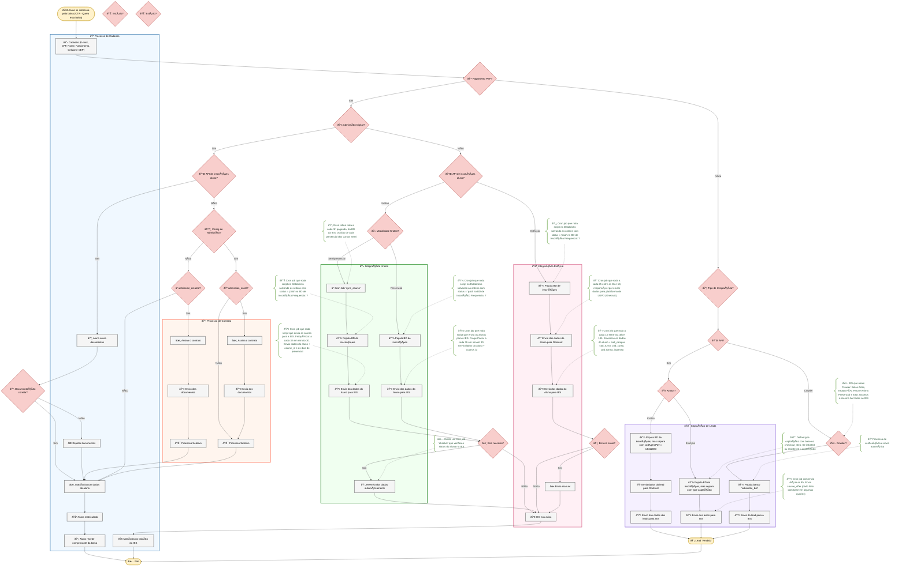

```mermaid
%%{init: {
    "theme": "default",
    "themeVariables": {
        "primaryColor": "#ffffff",
        "primaryTextColor": "#000000",
        "primaryBorderColor": "#666666",
        "lineColor": "#333333",
        "sectionBkgColor": "#f8f9fa",
        "altSectionBkgColor": "#e9ecef",
        "gridColor": "#cccccc",
        "c0": "#f0f8ff",
        "c1": "#f5f5f5", 
        "c2": "#f0fff0",
        "c3": "#fff5ee",
        "c4": "#f5f0ff"
    }
}}%%

flowchart TD
    %% 💬 Green comment nodes based on the image
    COMMENT1@{ shape: comment, label: "🔄 Essa rotina roda a cada 3h pegando, do BD da IES, os dias de aula presencial dos cursos Semi" }
    COMMENT2@{ shape: comment, label: "📊 Cron job que roda script no Databricks salvando as ordens com status = 'paid' no BD de Inscrição Frequencia: ?" }
    COMMENT3@{ shape: comment, label: "📤 Cron job que roda script que envia os alunos para a IES. Frequência: a cada 3h em minuto 30. Envia dados do aluno + course_id e os dias de presencial" }
    COMMENT4@{ shape: comment, label: "💾 Cron job que roda script no Databricks salvando as ordens com status = 'paid' no BD de Inscrição Frequencia: ?" }
    COMMENT5@{ shape: comment, label: "🚀 Cron job que roda script que envia os alunos para a IES. Frequência: a cada 3h em minuto 30. Envia dados do aluno + course_id" }
    COMMENT6@{ shape: comment, label: "✅ Existe um cron job 'checker' que verifica o status do aluno na IES" }
    COMMENT7@{ shape: comment, label: "💿 Cron job que roda script no Databricks salvando as ordens com status = 'paid' no BD de Inscrição Frequencia: ?" }
    COMMENT8@{ shape: comment, label: "🔠Cron job que roda a cada 2h entre as 6h e 18, responsável por enviar dados para plataforma de LGPD (Onetrust)" }
    COMMENT9@{ shape: comment, label: "📋 Cron job que roda a cada 1h entre as 10h e 14h. Enviamos os dados do aluno + cod_campus cod_turno, cod_curso, cod_forma_ingresso" }
    COMMENT10@{ shape: comment, label: "🎯 Define type captação com base no checkout_step. Se initiated ou registered = captação" }
    COMMENT11@{ shape: comment, label: "📤 Cron job com envio diário as 8h. Envia course_offer (dado feito com base em algumas queries)" }
    COMMENT12@{ shape: comment, label: "🤖 IES que usam Crawler: Belas Artes, Kroton Pós, FMU e Anima Presencial e EaD. Usamos o mesmo bot todas as IES" }
    COMMENT13@{ shape: comment, label: "🔠Processo de verificação e envio automático" }

    %% 🟡 Início e fim do processo (Yellow START/END nodes)
    INICIO(["🚀 Aluno se interessa pela bolsa (CTA - Quero esta bolsa)"])
    FIM(["✅ Fim"])
    LEAD(["💡 Lead 'Vendido'"])
    
    %% Subgraph para processo de cadastro
    subgraph SG1 ["📠Processo de Cadastro"]
        AC7["📋 Cadastro (E-mail, CPF, Nome, Nascimento, Celular e CEP)"]
        AC8["📄 Aluno envia documentos"]
        AC9["⌠Rejeitar documentos"]
        AC10["âœï¸ Matrícula com dados do aluno"]
        AC11["🎓 Aluno matriculado"]
        AC23["📄 Aluno recebe comprovante da bolsa"]
        AC24["🢠Matrícula no balcão da IES"]
    end
    
    %% Subgraph para processo de contrato
    subgraph SG2 ["📋 Processo de Contrato"]
        AC1["âœï¸ Assina o contrato"]
        AC2["📤 Envio dos documentos"]
        AC3["🎯 Processo Seletivo"]
        AC4["âœï¸ Assina o contrato"]
        AC5["📤 Envia dos documentos"]
        AC6["🎯 Processo Seletivo"]
    end
    
    %% Subgraph para integração Kroton
    subgraph SG3 ["🫠Integração Kroton"]
        AC12["â° Cron Job 'sync_course'"]
        AC13["💾 Popula BD de inscrições"]
        AC14["📤 Envio dos dados do Aluno para IES"]
        AC15["💾 Popula BD de inscrições"]
        AC16["📤 Envio dos dados do Aluno para IES"]
        AC17["🔄 Reenvio dos dados automáticamente"]
    end
    
    %% Subgraph para integração Estácio
    subgraph SG4 ["🎓 Integração Estácio"]
        AC18["💾 Popula BD de inscrições"]
        AC19["🔠Envio dos dados do Aluno para Onetrust"]
        AC20["📤 Envio dos dados do Aluno para IES"]
        AC21["📞 IES nos avisa"]
        AC22["✋ Envio manual"]
    end
    
    %% Subgraph para captação de leads
    subgraph SG5 ["🎯 Captação de Leads"]
        AC25["💾 Popula BD de inscrições, mas separa com type captação"]
        AC26["📤 Envio dos leads para IES"]
        AC27["💾 Popula BD de inscrições, mas separa com codAgentPdv = 14412833"]
        AC28["🔠Envia dados do lead para Onetrust"]
        AC29["📤 Envio dos dados dos leads para IES"]
        AC30["💾 Popula banco 'subscribe_bot'"]
        AC31["📤 Envio do lead para a IES"]
    end
    
    %% 🌸 Decisões principais (Pink IF nodes)
    IF1{"â“ admission_created?"}
    IF2{"âš™ï¸ Config de Admissão?"}
    IF3{"📠admission_enroll?"}
    IF4{"💳 Pagamento PEF?"}
    IF5{"📱 Admissão Digital?"}
    IF6{"🔌 API de inscrições aluno?"}
    IF7{"📋 Documentação correta?"}
    IF8{"🫠Modalidade Kroton?"}
    IF9{"âš ï¸ Erro no envio?"}
    IF10{"🔌 API de inscrições aluno?"}
    IF11{"🎓 Estácio?"}
    IF12{"âš ï¸ Erro no envio?"}
    IF13{"🔄 Tipo de Integração?"}
    IF14{"🔌 API?"}
    IF15{"🫠Kroton?"}
    IF16{"🎓 Estácio?"}
    IF17{"🤖 Crawler?"}
    
    %% Fluxo principal
    INICIO --> AC7
    AC7 --> IF4
    
    %% Fluxo PEF (Pagamento)
    IF4 -->|Sim| IF5
    IF5 -->|Sim| IF6
    IF6 -->|Sim| AC8
    AC8 --> IF7
    IF7 -->|Sim| AC10
    IF7 -->|Não| AC9
    AC9 --> AC10
    AC10 --> AC11
    AC11 --> AC23
    AC23 --> FIM
    
    %% Fluxo sem PEF
    IF4 -->|Não| IF13
    
    %% Configuração de admissão
    IF6 -->|Não| IF2
    IF2 -->|Não| IF1
    IF1 -->|Sim| AC1
    AC1 --> AC2
    AC2 --> AC3
    AC3 --> AC10
    IF1 -->|Não| AC10
    
    IF2 -->|Sim| IF3
    IF3 -->|Sim| AC4
    IF3 -->|Não| AC6
    AC4 --> AC5
    AC5 --> AC6
    AC6 --> AC10
    
    %% Admissão não digital
    IF5 -->|Não| IF10
    IF10 -->|Kroton| IF8
    IF8 -->|Semipresencial| AC12
    AC12 --> AC13
    AC13 --> AC14
    AC14 --> IF9
    IF9 -->|Sim| AC17
    IF9 -->|Não| AC21
    AC17 --> AC21
    
    IF8 -->|Presencial| AC15
    AC15 --> AC16
    AC16 --> IF9
    
    IF10 -->|Estácio| AC18
    AC18 --> AC19
    AC19 --> AC20
    AC20 --> IF12
    IF12 -->|Sim| AC22
    IF12 -->|Não| AC21
    AC22 --> AC21
    AC21 --> AC24
    AC24 --> FIM
    
    %% Tipos de integração
    IF13 --> IF14
    IF14 -->|Sim| IF15
    IF15 -->|Kroton| AC27
    AC27 --> AC28
    AC28 --> AC29
    AC29 --> LEAD
    
    IF15 -->|Estácio| AC25
    AC25 --> AC26
    AC26 --> LEAD
    
    IF14 -->|Crawler| IF17
    IF17 --> AC30
    AC30 --> AC31
    AC31 --> LEAD
    
    LEAD --> FIM

    %% 💬 Green comment connections (dotted lines to show context)
    COMMENT1 -.-> AC12
    COMMENT2 -.-> AC13
    COMMENT3 -.-> AC14
    COMMENT4 -.-> AC15
    COMMENT5 -.-> AC16
    COMMENT6 -.-> AC17
    COMMENT7 -.-> AC18
    COMMENT8 -.-> AC19
    COMMENT9 -.-> AC20
    COMMENT10 -.-> AC25
    COMMENT11 -.-> AC26
    COMMENT12 -.-> IF17
    COMMENT13 -.-> AC30
    
    %% 🎨 Pastel Color Styling for better browser display
    
    %% 🌸 Pink IF nodes (Decision nodes) - Fixed styling
    style IF1 fill:#f8cecc,stroke:#b85450,stroke-width:2px,color:#000000
    style IF2 fill:#f8cecc,stroke:#b85450,stroke-width:2px,color:#000000
    style IF3 fill:#f8cecc,stroke:#b85450,stroke-width:2px,color:#000000
    style IF4 fill:#f8cecc,stroke:#b85450,stroke-width:2px,color:#000000
    style IF5 fill:#f8cecc,stroke:#b85450,stroke-width:2px,color:#000000
    style IF6 fill:#f8cecc,stroke:#b85450,stroke-width:2px,color:#000000
    style IF7 fill:#f8cecc,stroke:#b85450,stroke-width:2px,color:#000000
    style IF8 fill:#f8cecc,stroke:#b85450,stroke-width:2px,color:#000000
    style IF9 fill:#f8cecc,stroke:#b85450,stroke-width:2px,color:#000000
    style IF10 fill:#f8cecc,stroke:#b85450,stroke-width:2px,color:#000000
    style IF11 fill:#f8cecc,stroke:#b85450,stroke-width:2px,color:#000000
    style IF12 fill:#f8cecc,stroke:#b85450,stroke-width:2px,color:#000000
    style IF13 fill:#f8cecc,stroke:#b85450,stroke-width:2px,color:#000000
    style IF14 fill:#f8cecc,stroke:#b85450,stroke-width:2px,color:#000000
    style IF15 fill:#f8cecc,stroke:#b85450,stroke-width:2px,color:#000000
    style IF16 fill:#f8cecc,stroke:#b85450,stroke-width:2px,color:#000000
    style IF17 fill:#f8cecc,stroke:#b85450,stroke-width:2px,color:#000000

    %% 🟡 Yellow START/END nodes
    style INICIO fill:#fff2cc,stroke:#d6b656,stroke-width:2px,color:#000000
    style FIM fill:#fff2cc,stroke:#d6b656,stroke-width:2px,color:#000000
    style LEAD fill:#fff2cc,stroke:#d6b656,stroke-width:2px,color:#000000

    %% 🟢 Green COMMENT nodes - Changed to darker font
    style COMMENT1 fill:#d5e8d4,stroke:#82b366,stroke-width:2px,color:#2d5a3d
    style COMMENT2 fill:#d5e8d4,stroke:#82b366,stroke-width:2px,color:#2d5a3d
    style COMMENT3 fill:#d5e8d4,stroke:#82b366,stroke-width:2px,color:#2d5a3d
    style COMMENT4 fill:#d5e8d4,stroke:#82b366,stroke-width:2px,color:#2d5a3d
    style COMMENT5 fill:#d5e8d4,stroke:#82b366,stroke-width:2px,color:#2d5a3d
    style COMMENT6 fill:#d5e8d4,stroke:#82b366,stroke-width:2px,color:#2d5a3d
    style COMMENT7 fill:#d5e8d4,stroke:#82b366,stroke-width:2px,color:#2d5a3d
    style COMMENT8 fill:#d5e8d4,stroke:#82b366,stroke-width:2px,color:#2d5a3d
    style COMMENT9 fill:#d5e8d4,stroke:#82b366,stroke-width:2px,color:#2d5a3d
    style COMMENT10 fill:#d5e8d4,stroke:#82b366,stroke-width:2px,color:#2d5a3d
    style COMMENT11 fill:#d5e8d4,stroke:#82b366,stroke-width:2px,color:#2d5a3d
    style COMMENT12 fill:#d5e8d4,stroke:#82b366,stroke-width:2px,color:#2d5a3d
    style COMMENT13 fill:#d5e8d4,stroke:#82b366,stroke-width:2px,color:#2d5a3d

    %% ⚪ Grey ACTION nodes (All process/action nodes)
    style AC1 fill:#f5f5f5,stroke:#666666,stroke-width:2px,color:#000000
    style AC2 fill:#f5f5f5,stroke:#666666,stroke-width:2px,color:#000000
    style AC3 fill:#f5f5f5,stroke:#666666,stroke-width:2px,color:#000000
    style AC4 fill:#f5f5f5,stroke:#666666,stroke-width:2px,color:#000000
    style AC5 fill:#f5f5f5,stroke:#666666,stroke-width:2px,color:#000000
    style AC6 fill:#f5f5f5,stroke:#666666,stroke-width:2px,color:#000000
    style AC7 fill:#f5f5f5,stroke:#666666,stroke-width:2px,color:#000000
    style AC8 fill:#f5f5f5,stroke:#666666,stroke-width:2px,color:#000000
    style AC9 fill:#f5f5f5,stroke:#666666,stroke-width:2px,color:#000000
    style AC10 fill:#f5f5f5,stroke:#666666,stroke-width:2px,color:#000000
    style AC11 fill:#f5f5f5,stroke:#666666,stroke-width:2px,color:#000000
    style AC12 fill:#f5f5f5,stroke:#666666,stroke-width:2px,color:#000000
    style AC13 fill:#f5f5f5,stroke:#666666,stroke-width:2px,color:#000000
    style AC14 fill:#f5f5f5,stroke:#666666,stroke-width:2px,color:#000000
    style AC15 fill:#f5f5f5,stroke:#666666,stroke-width:2px,color:#000000
    style AC16 fill:#f5f5f5,stroke:#666666,stroke-width:2px,color:#000000
    style AC17 fill:#f5f5f5,stroke:#666666,stroke-width:2px,color:#000000
    style AC18 fill:#f5f5f5,stroke:#666666,stroke-width:2px,color:#000000
    style AC19 fill:#f5f5f5,stroke:#666666,stroke-width:2px,color:#000000
    style AC20 fill:#f5f5f5,stroke:#666666,stroke-width:2px,color:#000000
    style AC21 fill:#f5f5f5,stroke:#666666,stroke-width:2px,color:#000000
    style AC22 fill:#f5f5f5,stroke:#666666,stroke-width:2px,color:#000000
    style AC23 fill:#f5f5f5,stroke:#666666,stroke-width:2px,color:#000000
    style AC24 fill:#f5f5f5,stroke:#666666,stroke-width:2px,color:#000000
    style AC25 fill:#f5f5f5,stroke:#666666,stroke-width:2px,color:#000000
    style AC26 fill:#f5f5f5,stroke:#666666,stroke-width:2px,color:#000000
    style AC27 fill:#f5f5f5,stroke:#666666,stroke-width:2px,color:#000000
    style AC28 fill:#f5f5f5,stroke:#666666,stroke-width:2px,color:#000000
    style AC29 fill:#f5f5f5,stroke:#666666,stroke-width:2px,color:#000000
    style AC30 fill:#f5f5f5,stroke:#666666,stroke-width:2px,color:#000000
    style AC31 fill:#f5f5f5,stroke:#666666,stroke-width:2px,color:#000000

    %% 🎨 Enhanced subgraph styling with emoticons and pastel colors
    style SG1 fill:#f0f8ff,stroke:#4682b4,stroke-width:3px,color:#000000
    style SG2 fill:#fff5ee,stroke:#ff6347,stroke-width:3px,color:#000000
    style SG3 fill:#f0fff0,stroke:#228b22,stroke-width:3px,color:#000000
    style SG4 fill:#fff0f5,stroke:#db7093,stroke-width:3px,color:#000000
    style SG5 fill:#f5f0ff,stroke:#9370db,stroke-width:3px,color:#000000
```