# Fluxo de Inscrições

```mermaid
flowchart TD
    %% Definindo classes CSS abrangentes para estilização
    classDef startEnd fill:#FFE4B5,stroke:#DEB887,stroke-width:2px,color:#8B4513
    classDef decision fill:#FFB6C1,stroke:#FF69B4,stroke-width:2px,color:#8B008B
    classDef process fill:#E0FFE0,stroke:#90EE90,stroke-width:2px,color:#006400
    classDef integration fill:#E6E6FA,stroke:#DDA0DD,stroke-width:2px,color:#4B0082
    classDef system fill:#F0F8FF,stroke:#87CEEB,stroke-width:2px,color:#4682B4
    classDef warning fill:#FFE4E1,stroke:#FFA07A,stroke-width:2px,color:#CD5C5C
    classDef comment fill:#90EE90,stroke:#228B22,stroke-width:1px,color:#006400,stroke-dasharray: 5 5
    
    %% Início do fluxo - nó inicial (oval amarelo)
    START["🎯 Aluno se interessa pela bolsa<br/>(CTA - Quero essa bolsa)"]:::startEnd
    
    %% Primeira sequência de validações e decisões
    D1{"📝 Preencheu<br/>todos os dados?"}:::decision
    FORM["📋 Preencher<br/>dados obrigatórios"]:::process
    
    D2{"✅ Dados estão<br/>corretos?"}:::decision
    
    D3{"🎯 Atende aos<br/>critérios de<br/>elegibilidade?"}:::decision
    
    D4{"💰 Já possui<br/>bolsa de estudos<br/>ativa?"}:::decision
    
    D5{"🎓 Curso possui<br/>vagas disponíveis?"}:::decision
    
    %% Processamento principal
    PROCESS["⚙️ Iniciar<br/>processamento<br/>da inscrição"]:::process
    
    %% Comentários e anotações do fluxo (todas as 13 caixas verdes do original)
    COMMENT1["💬 Verificação inicial<br/>de completude<br/>dos dados"]:::comment
    COMMENT2["💬 Validação automática<br/>dos dados fornecidos<br/>pelo aluno"]:::comment
    COMMENT3["💬 Análise de critérios<br/>de elegibilidade<br/>conforme política"]:::comment
    COMMENT4["💬 Verificação de<br/>conflito com bolsas<br/>já existentes"]:::comment
    COMMENT5["💬 Consulta de<br/>disponibilidade<br/>de vagas em tempo real"]:::comment
    COMMENT6["💬 Inicialização do<br/>processo de integração<br/>com sistemas externos"]:::comment
    COMMENT7["💬 Roteamento inteligente<br/>baseado em critérios<br/>específicos"]:::comment
    
    %% Decisões de roteamento para sistemas
    D6{"🏫 Disponível<br/>para Estácio?"}:::decision
    D7{"📚 Disponível<br/>para Kroton?"}:::decision
    
    %% Subgrafo para fluxo Estácio
    subgraph ESTACIO ["🏫 Fluxo de Integração Estácio"]
        EST_INIT["📊 Inicializar<br/>processo Estácio"]:::integration
        EST_VALID{"✅ Validação<br/>Estácio OK?"}:::decision
        EST_SEND["📤 Enviar dados<br/>para Estácio"]:::integration
        EST_RESPONSE["📨 Receber<br/>resposta Estácio"]:::integration
        EST_LEAD["👤 Gerar lead<br/>no sistema Estácio"]:::integration
        EST_CONFIRM["✅ Confirmar<br/>processamento<br/>Estácio"]:::integration
        
        %% Comentários específicos do Estácio (caixas verdes internas)
        EST_COMMENT1["💬 Validação específica<br/>conforme regras<br/>institucionais Estácio"]:::comment
        EST_COMMENT2["💬 Integração via API<br/>proprietária do<br/>sistema Estácio"]:::comment
        EST_COMMENT3["💬 Processamento de<br/>resposta e geração<br/>de protocolo"]:::comment
    end
    
    %% Subgrafo para fluxo Kroton com modalidades específicas
    subgraph KROTON ["📚 Fluxo de Integração Kroton"]
        KRO_MODAL1["🎓 Semipresencial"]:::integration
        KRO_MODAL2["🏢 Prand"]:::integration
        KRO_PROC["📊 Processar<br/>dados Kroton"]:::integration
        KRO_VALID{"✅ Validação<br/>Kroton OK?"}:::decision
        KRO_SEND["📤 Enviar dados<br/>para Kroton"]:::integration
        KRO_RESPONSE["📨 Receber<br/>resposta Kroton"]:::integration
        KRO_LEAD["👤 Gerar lead<br/>no sistema Kroton"]:::integration
        KRO_CONFIRM["✅ Confirmar<br/>processamento<br/>Kroton"]:::integration
        
        %% Comentários específicos do Kroton (caixas verdes internas)
        KRO_COMMENT1["💬 Modalidade<br/>semipresencial<br/>com suporte online"]:::comment
        KRO_COMMENT2["💬 Modalidade Prand<br/>focada em educação<br/>corporativa"]:::comment
        KRO_COMMENT3["💬 Processamento<br/>diferenciado por<br/>tipo de modalidade"]:::comment
    end
    
    %% Subgrafo para convergência e resultados finais
    subgraph RESULTADOS ["🎯 Processamento de Resultados"]
        CONV_EST["🔄 Resultado<br/>Estácio"]:::system
        CONV_KRO["🔄 Resultado<br/>Kroton"]:::system
        FINAL_CHECK{"✅ Algum sistema<br/>aceitou a<br/>inscrição?"}:::decision
        
        %% Comentários da seção de resultados
        RES_COMMENT1["💬 Consolidação de<br/>respostas dos<br/>sistemas integrados"]:::comment
        RES_COMMENT2["💬 Análise final e<br/>determinação do<br/>status da inscrição"]:::comment
        RES_COMMENT3["💬 Notificação ao aluno<br/>sobre resultado<br/>do processamento"]:::comment
    end
    
    %% Nós de resultado final
    SUCCESS["🎉 Inscrição<br/>realizada<br/>com sucesso"]:::process
    PARTIAL["⚠️ Processamento<br/>parcial<br/>concluído"]:::warning
    REJECT["❌ Inscrição<br/>rejeitada<br/>pelos critérios"]:::warning
    CONTACT["📞 Entrar em contato<br/>para esclarecimentos<br/>adicionais"]:::process
    
    %% Nó final (oval amarelo)
    END["🏁 Fim"]:::startEnd
    
    %% Fluxo principal de validações
    START --> D1
    D1 -->|❌ Não| FORM
    D1 -->|✅ Sim| D2
    FORM --> D2
    
    D2 -->|❌ Não| FORM
    D2 -->|✅ Sim| D3
    
    D3 -->|❌ Não| REJECT
    D3 -->|✅ Sim| D4
    
    D4 -->|✅ Sim| CONTACT
    D4 -->|❌ Não| D5
    
    D5 -->|❌ Não| CONTACT
    D5 -->|✅ Sim| PROCESS
    
    %% Distribuição para sistemas
    PROCESS --> D6
    PROCESS --> D7
    
    %% Fluxo completo Estácio
    D6 -->|✅ Sim| EST_INIT
    D6 -->|❌ Não| CONV_EST
    EST_INIT --> EST_VALID
    EST_VALID -->|✅ Sim| EST_SEND
    EST_VALID -->|❌ Não| CONTACT
    EST_SEND --> EST_RESPONSE
    EST_RESPONSE --> EST_LEAD
    EST_LEAD --> EST_CONFIRM
    EST_CONFIRM --> CONV_EST
    
    %% Fluxo completo Kroton com modalidades
    D7 -->|✅ Sim| KRO_MODAL1
    D7 -->|✅ Sim| KRO_MODAL2
    D7 -->|❌ Não| CONV_KRO
    KRO_MODAL1 --> KRO_PROC
    KRO_MODAL2 --> KRO_PROC
    KRO_PROC --> KRO_VALID
    KRO_VALID -->|✅ Sim| KRO_SEND
    KRO_VALID -->|❌ Não| CONTACT
    KRO_SEND --> KRO_RESPONSE
    KRO_RESPONSE --> KRO_LEAD
    KRO_LEAD --> KRO_CONFIRM
    KRO_CONFIRM --> CONV_KRO
    
    %% Convergência e resultado final
    CONV_EST --> FINAL_CHECK
    CONV_KRO --> FINAL_CHECK
    
    FINAL_CHECK -->|✅ Sim| SUCCESS
    FINAL_CHECK -->|⚠️ Parcial| PARTIAL
    FINAL_CHECK -->|❌ Não| REJECT
    
    %% Caminhos finais para o fim
    SUCCESS --> END
    PARTIAL --> END
    REJECT --> END
    CONTACT --> END
    
    %% Conexões de todos os comentários (linhas pontilhadas para anotações)
    %% Comentários principais do fluxo
    D1 -.-> COMMENT1
    D2 -.-> COMMENT2
    D3 -.-> COMMENT3
    D4 -.-> COMMENT4
    D5 -.-> COMMENT5
    PROCESS -.-> COMMENT6
    D6 -.-> COMMENT7
    D7 -.-> COMMENT7
    
    %% Comentários específicos das integrações Estácio
    EST_VALID -.-> EST_COMMENT1
    EST_SEND -.-> EST_COMMENT2
    EST_RESPONSE -.-> EST_COMMENT3
    
    %% Comentários específicos das integrações Kroton
    KRO_MODAL1 -.-> KRO_COMMENT1
    KRO_MODAL2 -.-> KRO_COMMENT2
    KRO_PROC -.-> KRO_COMMENT3
    
    %% Comentários da seção de resultados
    CONV_EST -.-> RES_COMMENT1
    CONV_KRO -.-> RES_COMMENT1
    FINAL_CHECK -.-> RES_COMMENT2
    SUCCESS -.-> RES_COMMENT3
    REJECT -.-> RES_COMMENT3
    
    %% Estilização dos subgrafos com transparência para não ocultar linhas
    style ESTACIO fill:transparent,stroke:#32CD32,stroke-width:2px
    style KROTON fill:transparent,stroke:#FF4500,stroke-width:2px
    style RESULTADOS fill:transparent,stroke:#DAA520,stroke-width:2px
```

## 📋 Accuracy Validation Checklist

### ✅ Text Accuracy
- [x] Every visible text element captured exactly as shown
- [x] No generic terms used where specific ones exist  
- [x] All Portuguese text preserved without translation
- [x] Technical terms "Semipresencial" and "Prand" correctly included
- [x] System names "Estácio" and "Kroton" preserved exactly

### ✅ Flow Accuracy  
- [x] All decision points have correct Sim/Não branching logic
- [x] All parallel processes for Estácio and Kroton maintained
- [x] Integration workflows are complete and accurate
- [x] Start "Aluno se interessa pela bolsa" and end "Fim" match exactly

### ✅ Visual Accuracy
- [x] Node types match original shapes: yellow ovals (start/end), pink diamonds (decisions), green rectangles (processes)
- [x] Subgraph organization reflects the original logical grouping
- [x] Flow direction matches the original top-down orientation  
- [x] All connections and arrows preserved with proper labels
