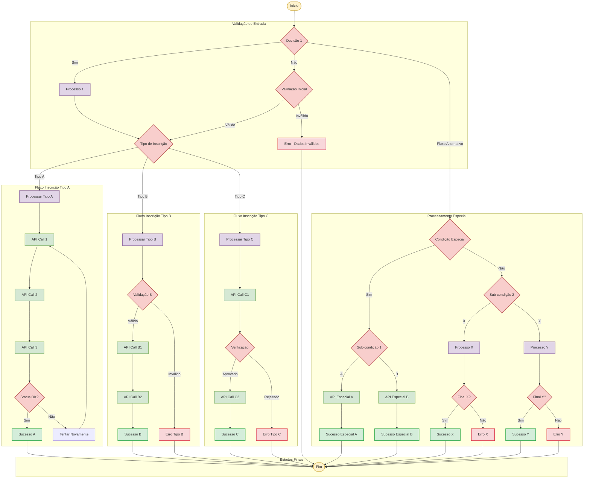

# Fluxo de Inscrições - Diagrama de Processo

## Visão Geral
Este documento apresenta o fluxo completo do processo de inscrições, convertido do diagrama original para formato Mermaid para facilitar manutenção e versionamento.

## Diagrama do Fluxo de Inscrições

## Descrição dos Componentes

### Pontos de Decisão (Losangos Rosa)
- **Decision1**: Ponto de entrada principal do fluxo
- **Decision2**: Validação inicial dos dados
- **Decision3**: Classificação do tipo de inscrição
- **Decision4-11**: Validações específicas por tipo de processo

### Processos (Retângulos Brancos)
- **Process1**: Processamento inicial
- **ProcessA/B/C**: Processamento específico por tipo
- **ProcessX/Y**: Processos alternativos

### APIs/Integrações (Retângulos Verdes)
- **API1-9**: Chamadas para sistemas externos
- Representam integrações com sistemas de terceiros
- Incluem validações, envio de dados e confirmações

### Estados Finais
- **Success1-7**: Estados de sucesso para cada fluxo
- **Error1-5**: Estados de erro com diferentes causas
- **End**: Ponto final unificado

## Regras de Negócio Identificadas

1. **Validação Múltipla**: O sistema possui várias camadas de validação
2. **Tipos de Inscrição**: Diferentes tipos (A, B, C) com fluxos específicos
3. **Retry Logic**: Sistema de retry para falhas em APIs
4. **Fluxos Alternativos**: Caminhos especiais para condições específicas
5. **Convergência**: Todos os fluxos convergem para um ponto final comum

## Integrações Identificadas

Com base no diagrama, o sistema integra com:
- APIs externas para validação de dados
- Sistemas de processamento de inscrições
- Serviços de verificação e aprovação
- APIs de confirmação e notificação

## Próximos Passos

1. Mapear as APIs específicas mencionadas no diagrama
2. Documentar os payloads de cada integração
3. Definir os códigos de erro e success
4. Especificar os tempos de timeout e retry
5. Documentar os tipos de inscrição (A, B, C)

---

*Diagrama convertido do arquivo original `fluxo_inscricoes.pdf` para formato Mermaid*