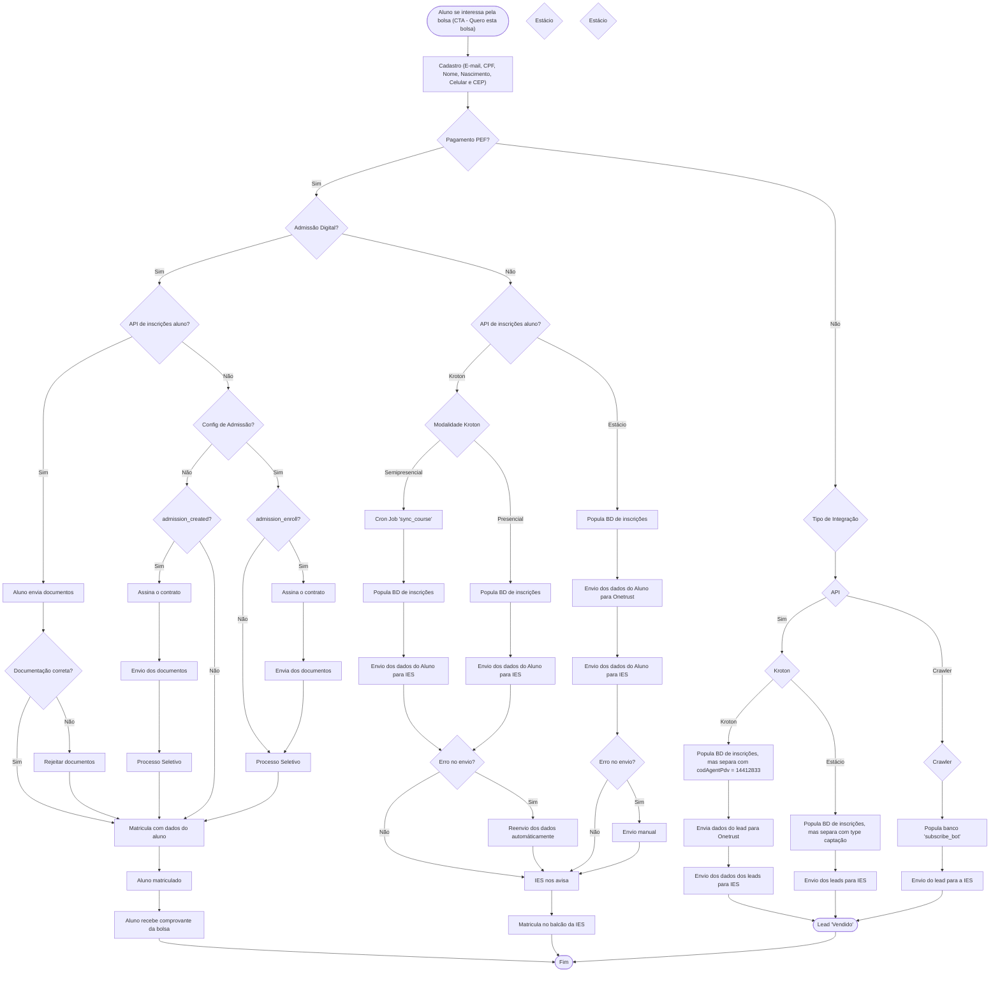

# Fluxo de Inscrições - Integração com IES

Este documento apresenta o fluxo completo de inscrições e integrações com as Instituições de Ensino Superior (IES), incluindo os processos para Kroton e Estácio.

## Visão Geral

O fluxo de inscrições gerencia todo o processo desde o interesse inicial do aluno até a efetivação da matrícula, incluindo diferentes tipos de integração (API e Crawler) e modalidades de ensino.

## Diagrama do Fluxo

## Principais Componentes do Fluxo

### 1. Processo Inicial
- **Cadastro**: Coleta de dados básicos do aluno (E-mail, CPF, Nome, Nascimento, Celular e CEP)
- **Verificação PEF**: Determina se há pagamento PEF envolvido

### 2. Fluxos de Admissão
- **Admissão Digital**: Processo online com API de inscrições
- **Admissão Tradicional**: Processo com diferentes configurações baseadas em admission_created e admission_enroll

### 3. Integrações por IES

#### Kroton
- **Modalidade Semipresencial**: Utiliza Cron Job 'sync_course' e população do BD
- **Modalidade Presencial**: Processo direto de envio de dados
- **Tratamento de Erros**: Reenvio automático em caso de falha

#### Estácio
- **Integração com Onetrust**: Envio de dados para plataforma intermediária
- **Envio para IES**: Comunicação direta com a instituição
- **Fallback Manual**: Envio manual em caso de erro

### 4. Tipos de Integração
- **API**: Integração automática via interfaces de programação
- **Crawler**: Integração via automação web para captação de leads

### 5. Gestão de Leads
- Separação por tipo de captação
- Códigos específicos para diferentes agentes (codAgentPdv = 14412833)
- População de banco subscribe_bot para gestão de leads

## Pontos de Decisão Importantes

1. **Pagamento PEF**: Determina o fluxo principal vs. fluxo de integração
2. **Admissão Digital**: Define se usa API ou processo tradicional
3. **Modalidade de Ensino**: Influencia o processo de integração (Kroton)
4. **Documentação**: Validação para aprovação ou rejeição
5. **Tratamento de Erros**: Mecanismos de reenvio automático e manual

## Resultados Finais

O fluxo pode terminar em três estados principais:
1. **Aluno Matriculado**: Processo completo de admissão digital
2. **Matrícula Presencial**: Processo que requer presença na IES
3. **Lead Vendido**: Processo de captação para posterior conversão

---

*Este diagrama representa o fluxo atual das integrações com IES e pode ser atualizado conforme novas funcionalidades são implementadas.*
